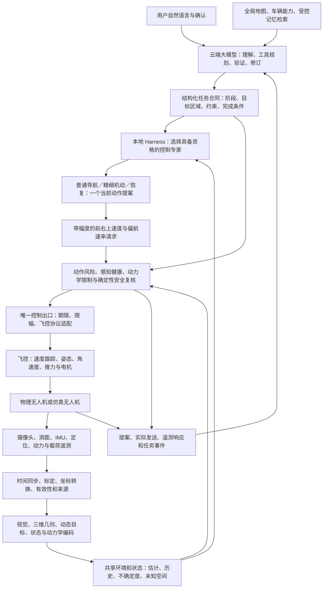
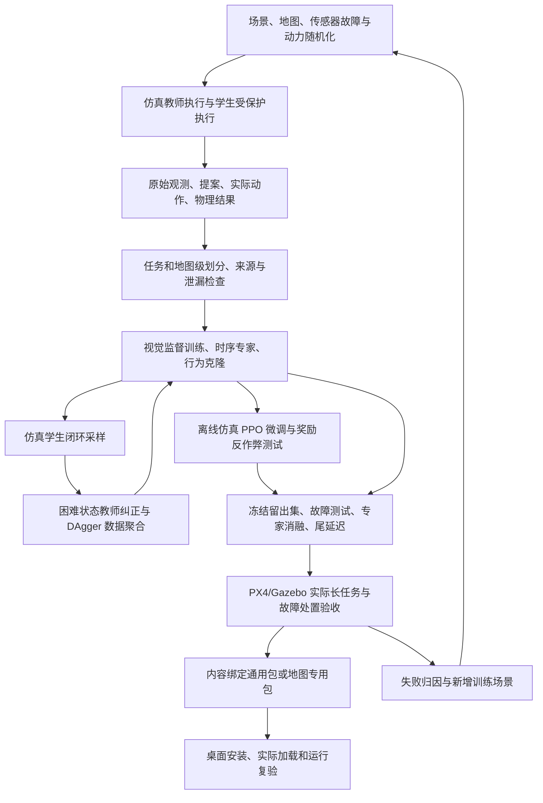

# 自主飞行架构与整体交付总计划

规划日期：2026-09-07。状态：总体设计与实施约束，尚非整体验收报告。

本计划将用户反复确认的「云端大模型＋多个本地专家小模型＋Harness」收拢为同一条运行链、训练链和交付链。后续按这里的依赖与完成条件推进，不再以一次补丁、一批单测或模型数量作为整体完成的依据。

本文规定后续目标与决策；[实施基线](CONTINUOUS_CONTROL_UPGRADE.md)保存已发生的代码变化、模型清单和证据；[模块边界](CONTROL_MODULE_BOUNDARIES.md)规定代码维护方式；[早期多传感器设计](MULTIMODAL_SENSOR_EXPERT_ARCHITECTURE.md)保留技术背景与历史实验。目标冲突以本计划为准，当前能力必须以匹配实际资产的证据为准。不能据此覆盖原始实验记录或把规划改写为成功记录。

## 一、唯一的产品目标与交付边界

用户用自然语言提出长任务，查看并确认计划；真实运行的 PX4/Gazebo 无人机完成办公室出发、穿门、楼梯、室外通行、取件悬停、负载变化、送达或返航、降落。期间允许在取件前更改取件位置，或取件后更改送达位置。系统依靠当前传感器持续观察和控制，不瞬移、不脚本修改位置、不借旧路线执行冒充学习控制。

本次整体交付是「可安装的、在声明条件内经过验收的仿真自主飞行产品链」，包含以下不可拆开的内容：

- 传感器适配与编码、状态与三维环境理解、本地连续控制、云端规划和任务修改、Harness 权限仲裁。
- 与当前输入输出语义相符的训练数据、实际训练权重、离线评估、闭环任务证据。
- 离线训练和地图专用包的完整工具链，以及同一包在桌面和 Runtime 中的实际加载验证。
- 通用接口、多飞控能力声明和适配测试；只把实际验收过的飞控、传感器组合和地图范围标为支持。

不把仿真通过等同于真实无人机开放环境可用，也不声称任何地图、天气、载荷或故障下都必定成功。真实硬件接入仍沿同一架构，但必须另做台架、受控场地与飞行资格验证。物理硬件的存在、标定和性能不能由软件中的枚举代替。

正常任务要完成；不可行任务要有证据地拒绝或安全终止。安全终止不是任务完成，也不一定是安全系统失败，报告必须分别计数。

## 二、运行架构：模型真正控制运动

下面是目标结构，不是当前所有箭头均已完成验收的声明。

三个时间尺度不能混成一个循环：

| 层级 | 决定什么 | 不负责什么 |
| --- | --- | --- |
| 云端大模型 | 要做什么、经过哪些区域、工具检查是否可行、何时改全局计划、任务是否完成 | 每帧制动、每次转向幅度、电机控制 |
| 本地编码与专家 | 周围是什么、状态是否可信、当前具体向哪个方向以多大幅度运动、何时减速/转向/恢复 | 擅自改变用户目标、取消安全规则、在线改权重 |
| 安全与飞控 | 当前动作能否执行、物理限幅、失效处理、姿态和推力跟踪 | 用固定路线长期替模型代飞后把功劳计给模型 |

环境不确定，意味着估计带误差、策略依赖实时观测，而不是所有模块都应随机或者都必须用神经网络。坐标转换、状态估计、几何求解与物理约束仍是必要基础。

### 软件、机载计算与飞控分别部署在哪里

- 当前仿真档案：桌面负责账户、任务与配置；本地 Agent Core/Runtime 负责规划组织和专家推理；Gazebo 与 PX4 产生物理状态和传感器流。Windows/WSL 边界的传输延迟也计入测量，不能因为在同一电脑就忽略。
- 真实飞行目标档案：低延迟感知、动作策略与安全出口部署在无人机伴随计算设备，直接连接传感器和飞控；桌面承担任务管理，云端承担慢速认知。模型下载到用户电脑，不等于它已经安装到机载设备；还需要受管理的下发、硬件兼容检查、启动和实际哈希读回。
- 若某个档案选择在地面电脑推理、通过无线链路控制，只能在该链路的时延、丢包、距离和断链处置已单独验收的范围使用，不能宣称等同于机载低延迟控制。
- 无论推理运行在哪里，飞控必须独立保持姿态控制与失效处置；UI 关闭、云端不可达、推理进程崩溃都不能让过期模型指令无限执行。

### 控制量的明确选择

当前产品主接口采用四个连续轴 `forward_axis`、`right_axis`、`up_axis`、`yaw_axis`，范围均为 `[-1, 1]`。车辆适配后分别成为 m/s 的机体前/右/上速度与 deg/s 的偏航速率。速度合量、加速度、加加速度和偏航变化受车辆、阶段、载荷与安全包络共同约束，取最严格限制。

这不是路程，也不是世界坐标，更不是电机功率。模型在每次新观测后决定新的速度请求；例如实测前进 0.8 m/s 时请求 0.2 m/s，飞控会在允许的制动能力内减速，不必一定请求负速度才叫制动。负速度还可能意味着减速后倒退，必须检查机后可观测空间。更紧急时安全层按当前动力能力制动，而非无限增大模型输出。

四轴归一化值、尺度及对应物理请求必须一起进入训练和风险评估。零偏航就是零转速；未观测不等于零值。动作有效期固定且不可由重复发送续期。任何未来的加速度或姿态接口都必须单独声明、训练和验收，不能把同一组数临时解释为另一种量。

PX4 支持不同层级的 Offboard 设定值；模式、消息字段和所需状态估计必须匹配。速度模式要明确排除位置字段抢占，不能只是把消息命名成速度控制。具体支持取决于实际固件及协议，适配层需验证而不是跨飞控照搬。[PX4 Offboard 官方说明](https://docs.px4.io/main/en/flight_modes/offboard)

轴方向采用项目明确声明的控制约定；角速度是旋转量，不能像平移向量一样随意反射。FRU 控制轴、FLU 右手旋转量与飞控 NED/FRD 的转换各只做一次，并以实体正反向运动测试验证。

## 三、传感器与编码：每种信息都必须有真正的下游作用

每个部署档案有一份实际能力清单：设备/仿真插件、消息源、采样频率、时钟、标定、外参、测量范围、健康判据、必需或可选、消费模块、退化策略、证据位置。以下是目标覆盖，不代表所有硬件当前已经连通。

| 信息来源 | 编码与融合方法 | 输出给后续的有效信息 | 实际控制影响与失效处理 |
| --- | --- | --- | --- |
| 前向 RGB | 已有轻量视觉骨干＋任务语义头；保留空间特征与图像质量，不只保留一个总分 | 门、楼梯、人员、障碍、取件标识的空间概率；置信度、帧龄 | 选择通道、人员避让、接近取件点；看不清则降低语义能力，不把黑画面解释成空地 |
| 深度、LiDAR、下视测距 | 按标定投影、去无效值、三维占据与自由空间更新、地板/天花板净空 | 米制距离、未知空间、可用视场、净空及不确定度 | 穿门、楼梯升降、制动、起降；过期或覆盖不足的方向不获准运动 |
| 雷达（确实安装时） | 目标/点迹关联与时间校准，按设备语义使用距离和径向速度 | 目标距离、相对运动及可观测方向 | 动态避障；单次径向速度不能伪装成完整三维速度，缺失则屏蔽该能力 |
| 视觉和测距动态目标 | 自运动补偿、数据关联、时序跟踪、带协方差的短期预测 | 目标身份、尺寸、位置、速度、预测占据、轨迹年龄 | 提前减速、让行、等待再通过；轨迹丢失按不确定障碍处理，不瞬间清空 |
| IMU、陀螺仪 | 原生数值校准、重力补偿、坐标转换、有界时序编码 | 比力/线加速度、旋转速度、振动、与期望响应的残差 | 精细控制、稳定性和动力学判断；重复帧不能填新历史，失效撤销对应权限 |
| GNSS、里程计、光流/VIO、气压计、磁力计 | 接入飞控状态估计及原生质量/协方差；必要的独立观测一致性检查 | 位置、速度、高度、航向、定位可信度及来源 | 地图配准、航向和高度控制；室内不依赖失效 GNSS，估计退化触发经验证的降级方式 |
| 电池、电流、电机/执行器遥测 | 时间窗口统计、执行响应与状态残差、负载时序编码 | 能量余量、推力余量、响应延迟、振动与失配 | 限制动作、判断返航可行性、故障处置；不得以「健康」常量代替缺失测量 |
| 载荷事件与载荷传感信息 | 真实挂载事件＋重量声明/测量＋飞行响应交叉验证 | 是否挂载、质量范围、重心/摆动风险、稳定性和可辨识性 | 取件后等待稳定，收缩速度/加速度、增加制动余量；超载或未知能力不继续载重航段 |

数值传感器可以共用物理状态估计器和时序编码器，不为凑模型数分别训练一个「GPS 网络」「气压网络」。神经网络预测或残差估计必须带不确定度，不能覆盖原始证据。

### 三维和时序补全的设计决策

- 现有水平八扇区摘要不足以单独支持楼梯、天花板与起降。目标编码使用方位＋俯仰分区，额外明确上/下净空；局部三维占据数据继续独立保留，不能只凭压缩特征授权穿越。
- 视觉空间特征与深度通过同源帧/时间与标定对应；低分辨率语义总分不能替代近障碍几何。保留轻量 MobileNetV3-Large/Lite R-ASPP 路线作为训练基线，而非先更换更大的模型。官方通用权重类别不等于本项目的楼梯、取件标识等自定义类别，必须验证实际任务头。[Torchvision 模型说明](https://docs.pytorch.org/vision/main/models/generated/torchvision.models.segmentation.lraspp_mobilenet_v3_large.html)
- 定位使用估计值、协方差、创新/质量及来源；移除几何融合支路的固定定位精度常量。仿真真值只允许进离线标签和独立验收器，不当作未来真实部署可得到的状态输入。
- 时序输入保存时间间隔和有效掩码。实施选择有限展开的因果 GRU（最初候选是 TCN），因为当前已有相同窗口下的 Torch→标准 ONNX 算子→生产加载器验证路径，且可以显式屏蔽缺失行；这不是未经测量的质量优越性声明。以 16 个独立样本为基础，历史每行包含 46 个状态、446 个实时特征、446 个掩码和源间隔/250 ms，共 939 个值；历史语义另有内容哈希，旧的无时间输入不能静默读取。载荷使用独立的较长物理响应窗口。改变宽度/语义须重新绑定、训练并验证。
- 历史换源、任务重置、时钟回退或大间隔时重建；不能跨不同飞行拼接历史。不做依赖未来帧的在线平滑。
- 所有时钟需区分设备采样、主机接收、编码、模型提交、模型完成与实际发送。无法可靠同步时明确采用接收时钟和传输上界，不能报告为已测得采样端到端延迟。

## 四、本地专家：按控制职责组织，不按文件数量凑能力

当前磁盘候选有 9 个 ONNX 文件：视觉、普通导航、精细机动、恢复、感知健康、稳定性、状态异常、跨模态一致性、负载动力学。该候选尚无独立的连续动作条件风险权重。后续代码已补上这个专家的训练、导出、运行时与否决接口，但只验证了合成测试权重，未训练产品权重。文件存在不等于已适配当前特征合同，也不等于当前长任务通过。

目标是以下十个学习职责；时序编码可以封装在专家模型内部，并不要求额外发布一个文件。以后不以 ONNX 文件数判断架构成熟度。

| 学习职责 | 输入 | 结构化输出 | 对控制的实际作用 |
| --- | --- | --- | --- |
| 视觉感知 | 当前 RGB、空间/时间身份 | 语义空间特征、质量、置信度 | 改变策略观察和可通行语义 |
| 普通导航 | 融合状态、局部目标/走廊、历史、能力限制 | 运动模式＋四轴连续请求 | 开阔和常规航段的加减速、转向、升降 |
| 精细机动 | 同一合同＋局部净空、姿态、阶段条件 | 同一四轴请求 | 穿门、楼梯、稳定悬停、取件、起降的小幅连续控制 |
| 恢复控制 | 同一合同＋有身份的阻塞/卡滞事件及历史 | 同一四轴请求＋恢复终止状态 | 有界退让、重新观察、重新接近；不能靠改阶段名假装恢复 |
| 连续动作风险（需补齐） | 共享状态＋本周期具体物理动作＋期限/载荷/制动能力 | 多时间窗风险、预测误差、不确定度 | 拒绝危险提案或限制可行动作域，不只评论「危险」 |
| 感知健康 | 来源年龄、质量、覆盖和故障特征 | 能力掩码与保守限制 | 确定哪些方向/机动还允许 |
| 稳定性 | 姿态、速度、加速度、振动和阶段历史 | 稳定程度＋阶段切换许可 | 决定何时开始挂载计时、何时可离开/确认降落 |
| 状态异常 | 状态历史、估计残差、来源质量 | 异常类别、置信度与动作限制 | 降速、撤销动作、触发恢复或飞控失效处置 |
| 跨模态一致性 | 对齐后的视觉/测距/定位/地图证据 | 冲突及相关能力限制 | 防止视觉误判空地、地图与实时观测冲突被忽略 |
| 负载动力学 | 指令—遥测响应、动力与载荷历史 | 保守动力能力估计/缩放及可信度 | 改变可用加速度、速度、制动包络，禁止超能力动作 |

策略训练结构采用「多模态特征＋因果时序编码＋非线性控制头」。普通、精细、恢复使用同一输入输出定义、分别训练并验收的权重；部署时每周期只有一个动作生产者。隐藏层宽度和参数量在冻结训练配置前通过实际硬件的质量/延迟基准决定，不以现有单隐藏层小网络的大小作为上限，也不为了显得强大无依据扩大。

控制专家输出动作；其余专家允许输出特征、否决或包络。后者有意义的条件是结果真的被消费：必须通过输入变化测试、故障注入与安全的消融对照证明它改变了下游控制或改善任务结果。仅增加一次推理、一段解释或一条日志不算能力。

### 连续动作风险不是旧的候选排序风险

风险输入必须包含本次拟执行的速度向量、偏航速率、动作有效期、估计执行延迟、车辆/载荷动力能力和当前状态，输出条件风险 `risk(state, proposed_action, horizon)`。不同方向与幅度应产生可检验的不同结果。观察本身的风险分数不能代替动作条件风险。

先由物理短期滚动预测提供几何基线，再训练残差/风险网络补充复杂响应和预测不确定度。预测时间窗至少覆盖当前速度下的响应和制动过程；不固定一个与速度无关的短窗口。离线训练用实际仿真反例和可重复的动作扰动，不把「未执行」直接标为危险或安全。

安全限幅改变动作后，最终动作仍需在同一预算内复核；计算预算耗尽则撤销本次动作，进入已验证的失效路径。不得无限循环求解、等待云端裁定或假定速度整体缩小就必然安全。

## 五、Harness：合作规则、权限和唯一控制出口

Harness 是连接模型、工具、状态、期限、权限与证据的运行组织层，不是一个额外的聊天模型。

1. 检查任务身份、用户确认、模型和资产资格、传感器与估计器状态。
2. 构造一致的当前观察快照；较旧的可选语义特征可以带年龄复用，但不能冒充刚拍摄。必需输入过期直接失去对应动作权限。
3. 按语义阶段、局部几何、事件和稳定持续时间选一个动作专家；加入切换迟滞、最短合理驻留和状态重置规则，避免导航/恢复来回抖动。严重故障可立即抢占。
4. 感知、状态、载荷等专家共同给出保守能力包络；不是对多个专家的速度向量求平均，也不是模型之间轮流聊天投票。
5. 动作专家在包络内提出连续请求；动作风险和独立几何/动力学复核决定是否放行。
6. 唯一控制出口核验最新状态、任务身份、命令期限和飞控模式，再发送并记录真实结果。
7. 下一轮读取实际响应更新状态、进展与异常；必要时向云端提交有界事件摘要。

缺少精细或恢复权重不能无条件退回普通模型。只有普通模型对该阶段/控制轴也具备明确资格时，才能使用预先声明的替代方案；否则不进入该阶段。载重航段同样不能因负载专家没就绪而悄悄略过。

安全层可以紧急制动、限幅或采取已验证的应急动作，但必须独立归因。它不能为了达成成功率而长期生成路线代飞。每条控制记录至少包含：原始提案、限制原因、最终发送值、来源类别、期限、飞控接收证据（协议支持时）、实际遥测变化。发送成功仅证明发送，不等于无人机已经产生期望运动。

插件可替换的是具备兼容合同和资格的能力模块。删除必需模块应使相应能力不可用，不自动绕开检查；飞行中不热替换权重、编码语义或安全边界。

## 六、云端调用、记忆与用户修改

云端有明确的调用目的和有限重试，不靠重复生成大段文字提升参与度：

| 调用目的 | 输入 | 结构化输出与验证 |
| --- | --- | --- |
| 意图整理 | 用户指令、澄清结果、可用地图/车辆 | 任务对象、取送点、时序、约束；缺失关键目标必须澄清 |
| 工具规划 | 意图、地图工具结果、能量/尺寸/载荷能力 | 阶段、路线走廊、目标区域、失败分支与验证要求 |
| 可行性复核与修订 | 候选计划、工具证据、检查器问题 | 逐项修复或拒绝；通过结构化和物理检查后供用户确认 |
| 运行重规划 | 当前阶段、紧凑环境变化、卡滞或用户改址 | 新任务合同；原子切换前重新验证权限与可行性 |
| 完成复核 | 实际位置、阶段履约、悬停时长、载荷和落地证据 | 可解释结果；任何语言结论不得覆盖独立验收器失败 |

工具包括地图查询、拓扑与三维路径求解、车辆净空/能源核算、当前状态、记忆检索等。让几何求解器算路线不违背模型驱动：模型决定任务和规划约束，本地策略决定沿途具体控制。工具输出和模型输出均不自动授予运动权限。

云端只处理慢时间尺度任务；本地不会同步等待它再避障。需要新计划期间，若旧合同仍允许且安全，可继续已授权局部航段；若用户已撤销旧目标或已无安全进展方案，则转入可维持的安全状态。悬停依赖有效定位、空间和剩余能量，不作为所有故障的万能答案；必要时执行经验证的飞控失效方案。

用户改址产生新的任务身份/修订令牌并撤销旧授权。晚到的云端回复和晚到的本地推理即便结构正确，也不能作用于新任务。取件状态已确认后不得因新计划倒退为「尚未取件」。

短时控制历史、当前局部世界、长期账户记忆各有独立寿命和权限。RAG 用于路线习惯、任务经验和已核实资产信息，不把过期记忆当实时障碍真值；检索内容不可修改安全规则。账户开关关闭即停止相应检索/写入，租户隔离必须实测。模型调用记录用途、请求身份、实际 usage 和记账状态，失败重试幂等，日志不含密钥。

## 七、时序与算力：按整条链测量

以下是拟定工程目标，不是已达成绩效。正式准入要绑定具体 CPU/GPU、运行负载、飞控及传感器组合；达不到时降速、减小允许场景或不准入，不能只放宽超时。

| 链路 | 目标调度 | 约束 |
| --- | --- | --- |
| 原生状态适配与观察器 | 独立于渲染，目标 50–100 Hz；源传感器按真实频率采样 | 有界历史，不通过复制同一包凑频率 |
| 三维测距更新 | 目标 20 Hz，受实际设备约束 | 保留采样时刻、覆盖和不确定度；不靠文件重写刷新年龄 |
| RGB 语义 | 异步目标 10–20 Hz | 最新值队列；语义帧龄上限按具体机动制定，初始设计上限 200 ms |
| 控制策略、相关专家与动作复核 | 目标 20 Hz | 状态/几何接收到发送的联合 P99 目标 ≤100 ms；精细阶段结合更低速度与实际净空收紧 |
| 飞控指令发送与失效监督 | 独立目标 20–50 Hz | 发送频率不是新决策频率，重复发送不延长授权 |
| 云端规划 | 事件触发，可用秒级或更长预算 | 不在本地控制线程；不等待云端维持安全 |

队列采用「一个执行中＋一个可替换的最新待处理项」或等价有界方案；过期输入不排长队。记录线程、视频压缩、数据库、UI、网络和训练不能阻塞动作出口。ONNX 会话常驻，线程与设备资源有明确上限；不在每帧重新载入模型，不同时启动多套不受控线程池。

完整测量拆开：采样→接收、排队、编码/视觉、融合、专家、风险/安全、发送、遥测响应。报告联合 P50/P95/P99/最大值、期限违反次数、有效动作覆盖和最长无有效授权时长。各模块 P99 的和不能标为实测端到端 P99。超过单次截止时间必须处理，即使总体 P99 看起来合格。

速度上限应由可见自由距离和动力能力反推。工程初筛可用 `可用距离 > 速度 × 最坏有效延迟 + 速度² / (2 × 保守制动加速度) + 误差余量`；正式安全判断仍需考虑三维方向、加加速度、动态障碍和载荷。几百毫秒对慢速开阔空间可能可接受，对高速窄门则未必。

PX4 的 Offboard 连续存活信号要求不是避障所需的决策频率，不能用「仍保持 Offboard」证明学习控制足够及时。[PX4 Offboard 官方说明](https://docs.px4.io/main/en/flight_modes/offboard)

## 八、离线学习闭环：数据、训练、奖惩和晋级

规划起点只有 NumPy 行为克隆；后续因果 BC、DAgger 和 PPO 优化代码及测试已按第十二节落地。算法实现、物理训练运行和晋级权重是不同证据，不能相互替代。

### 训练的明确路线

1. 冻结观测和动作合同后，采集真实仿真数据。教师允许使用确定性规划/控制完成示范，但数据记录实际发出的连续速度和偏航，以及实际物理反馈；不拿相邻路径点差值冒充手柄标签。
2. 监督训练视觉、状态/健康/一致性、稳定性、负载与动作风险；行为克隆训练普通、精细、恢复策略。恢复成功序列和恢复失败反例都保留，但不要把失败动作当正确示范。
3. 学生在受保护的仿真中运行，在它自己访问的偏离状态上请求教师纠正并聚合训练数据。这样处理「离线看起来准确，上场后越偏越远」的问题；采用 DAgger 的数据聚合思想，而非不断重复同一路教师直线样本。[DAgger 原始论文](https://proceedings.mlr.press/v15/ross11a.html)
4. 建立同合同的仿真 `reset/step/observation/action/termination` 训练环境，用 PPO 作为首个明确的连续策略强化微调方法。包括随机种子、采样器、价值网络、优势计算、裁剪目标、检查点和恢复，不只留一个名为 RL 的空接口。PPO 的训练价值网络不同于部署时的动作安全风险专家。[PPO 原始论文](https://arxiv.org/abs/1707.06347)
5. PPO 从通过基础检查的模仿策略开始，单个活动策略学习，其余已验证模块先冻结，避免多个专家同时漂移导致环境不断变化。回放基础能力数据/加入保留约束，分别验证角色提升和通用能力不退化。
6. 是否晋级 PPO 权重由独立闭环结果决定：如果没有稳定改善，发布通过验收的模仿学习权重，记录强化实验没有收益；不能为了贴强化学习标签发布更差模型。离线训练路径与实验记录仍属于完整工具链交付。
7. 优化导出模型并再次验证数值和行为。仿真训练期间采样可以探索，产品推理使用已冻结策略，不给执行动作额外注入训练探索噪声。

### 观测和标签必须分离

学生只能看到部署时真正可获取的传感器和估计结果。仿真真实坐标、无噪声障碍身份、未来轨迹和真实质量可以作为离线标签或独立验收依据；如训练价值网络使用特权状态，必须与部署策略输入完全隔离。不能给学生隐藏的精确位置再称为传感器自主导航。

每个样本保留任务/阶段/事件身份、时钟、输入合同、资产哈希、原始帧、模型提案、安全修改、最终发送和结果。BC 采用经过验证的示范动作；风险监督同时区分提议动作的反事实结果与实际被安全层替换后的结果。

强化训练同样记录原始策略动作及其 log probability 和实际应用动作。环境中的安全干预必须显式存在；不能把被修改的动作冒充策略原动作去计算策略梯度。大量依赖安全覆盖的策略不得晋级。

### 奖励、惩罚与防止钻空子

奖励配置有固定单位、权重、终止条件和哈希，训练和评估分开。下表的机制已落实到学习工具链；物理训练时的权重仍须通过训练集上的对照校准，不能在测试结果出来后改门槛。

| 项目 | 设计 | 防止学歪 |
| --- | --- | --- |
| 阶段/任务完成 | 由独立状态机和物理证据确认后一次性奖励 | 单说「完成」、经过附近、提前落地不获奖 |
| 有效进展 | 同一阶段内使用可行走廊上的距离势函数差分，而非只用直线距离 | 允许绕障和后退；禁止来回跨边界刷分；改址后重置基准并记录，不凭空赚奖励 |
| 安全 | 对碰撞、越界、不可恢复失控执行失败终止；训练中另有风险/干预代价 | 硬安全不是可被任务奖励抵消的罚分 |
| 控制质量 | 惩罚不必要的剧烈变化、振荡、超调、能源浪费 | 不用过强平滑惩罚阻止紧急制动 |
| 时间 | 对可推进阶段的无效拖延计成本 | 必须悬停的取件时间、合规让行和故障观察不按普通怠速惩罚 |
| 载荷与稳定 | 奖励在受限姿态、速度和可信负载状态下完成取件/离开 | 计时满不自动算已挂载；质量不可辨识不能输出高置信精确重量 |
| 恢复 | 有身份的事件、真实恢复进展、稳定退出才计收益 | 不能反复进出恢复阶段刷奖励，不能把原地抖动算前进 |

失败事件与安全终止需区分 `terminated` 和训练时间上限 `truncated` 的语义，价值目标正确处理时间截断。保存奖励各分项，针对提前降落、原地不动、碰撞捷径、来回刷进展、让安全层代飞建立自动反作弊场景。

域随机化覆盖光照/纹理/模糊、深度孔洞与误差、时钟偏移与丢帧、定位漂移、风、质量/惯量/重心、执行延迟、推力差异和电池状态。较快训练环境如不包含完整飞控动态，只能作预训练；候选最终必须回到真实 PX4/Gazebo 控制链验收。

### 通用与地图专用

通用训练保留未见地图；地图专用训练保留该地图未见路线、起终点、障碍配置和光照。按完整任务分组，禁止相邻帧随机跨训练/验证/测试，禁止反复看测试结果来调权重。参数调好后还需新冻结的留出活动验证。

地图专用包保存基座来源和修改后的必要专家，绑定地图、车辆、标定、特征和资格。基座保留，不能覆盖；切换前检查兼容性，飞行中不训练、不热换。地图内容或传感器布局变了，原专用资格不会自动继承。

## 九、贯通任务示例

任务：「从办公室去取件柜等 15 秒取件，再送回办公室。」

1. 云端查询实际地图、无人机尺寸/载重/能量与通道条件，规划办公室—门—楼梯—室外—取件柜—返程；工具验证净空和可行性后让用户确认。
2. 起飞由精细策略根据下方净空、姿态和升降速度连续给出上升/水平/偏航请求。到达预计高度不是仅凭脚本等待几秒，而是读取实际状态。
3. 走廊中普通策略持续看局部几何、语义、状态和粗目标，决定每次速度幅度。靠近门口转入精细策略，主动减速和对正。侧后方不可见时不会因为用户说可以飞就倒退进未知区域。
4. 行人横穿时，目标跟踪给出相对运动；风险专家评估当前动作，策略让行或制动。云端此时仍可处理计划，但本地不等它回复。
5. 到柜前稳定悬停才开始 15 秒计时。人员挂载通过仿真真实物理质量变化和事件读回确认；负载专家观察响应、检查限重和稳定性。仅修改 UI 的「已取件」标记不成立。真实硬件的挂载过程需专门的人员/桨叶安全操作方案，不能照搬仿真。
6. 用户改为送另一个地点时，先撤销旧目标授权；本地保持可行的安全控制，云端对新目标和剩余能量再规划，验证后原子切换。旧回复不能重新激活办公室目标。
7. 载重返程使用新动力包络，继续由动作专家控制；终点精细策略降落，稳定性与飞控落地状态共同确认，任务验证器检查所有履约证据后才报告成功。

例中每次具体速度由当时观察决定，不在文档预填一串坐标或一段固定速度脚本。模型可要求工具计算，硬安全可制动，但控制来源必须清楚。

## 十、代码组织与新旧隔离

不先做大规模目录搬迁，也不再在一个运行脚本里复制所有业务规则。沿现有职责增补，新增独立功能使用单一明确入口：

| 边界 | 现有主要落点 | 要补齐的职责 |
| --- | --- | --- |
| 合同与权限 | `contracts.py`、`control_feature_contract.py`、`control_authority.py` | 传感器/动作/任务/包的身份与时间规则，统一生成 Schema |
| 原生输入与编码 | `runtime_sensor_contracts.py`、`native_flight_state.py`、`realtime_feature_encoders.py` | 定位真实质量、独立采样、三维和时序语义 |
| 环境与视觉 | `depth_projection.py`、`depth_obstacle_tracker.py`、`local_world_model.py`、`local_vision_training.py` | 空间对应、动态预测、上/下净空和语义头证据 |
| 策略推理与仲裁 | `local_policy_port.py`、`local_expert_harness.py`、`perception_runtime.py` | 时序专家、动作风险、角色资格、唯一动作生产者 |
| 安全与执行 | `dynamic_safety.py`、`runtime_local_safety.py`、`runtime/`、执行入口脚本 | 模式/轴转换、动作复核、期限失效、物理读回 |
| 云端与记忆 | `orchestrator.py`、`verification.py`、`model_harness/` | 调用目的、工具证据、修订原子性、账户边界 |
| 离线学习 | 现有策略/顾问/视觉训练模块；计划增设独立 `training/` 包 | 数据分组、DAgger、仿真环境、PPO、奖励、检查点；不混入在线推理 |
| 资格与安装 | `local_policy_quality.py`、`local_policy_packages.py`、资格/打包脚本、应用 `runtime_manager.py` | 单一质量规则、总活动验收、原子选择、安装加载核对 |

以上相对源文件名属于 `src/dronedream_agent_core`，另行标注的目录除外。完整路径与现有边界参见[模块维护约定](CONTROL_MODULE_BOUNDARIES.md)。`training/` 是规划新增，不是已存在或完成的声明；迁移旧训练逻辑时旧 API 只能显式转发同一实现，不保留两套默认算法。

维护规则：

- 核心纯函数不隐式读时钟、文件或网络；依赖和时钟注入，传输层负责 I/O。
- 输入字段明确单位、坐标、缺失和不确定度；跨进程采用生成 Schema，不能只靠自由字典约定。
- 将训练和运行的特征编译共用；结构相同而语义不同必须视为不兼容。
- 通过调用图和打包清单查出旧默认入口。确认废弃的代码移除；确需留的教师/迁移工具显式隔离且禁止生产授权，不堆积整段注释代码。
- 不简单删除所有带旧名称的文件；先确认消费者和历史恢复需求，保存受保护证据。
- 对同一行为只有一个权威实现和配置来源，桌面、开发脚本、仿真入口必须一致。
- 新增模块同步提供正常、边界、错误、并发/时序和序列化测试。先写完整相互依赖的代码及测试代码，再执行该阶段验证；不拿未连通的单个演示提前飞行。

## 十一、安装、运行空间与资产身份

采用桌面安装器＋Runtime 管理器下载本地模型包；模型文件无需与主 EXE 硬绑在同一个大文件中，但用户安装完成后必须能离线进行本地推理。云端模型仍按用户配置调用 API。

除 WSL 外 50 GB 为完整本地受管理占用上限，而不是只看模型文件。以下为初始设计预算，单位为十进制 GB，尚非安装实测：

| 占用 | 预算上限 |
| --- | ---: |
| 桌面软件、Agent Core 与非 WSL 推理依赖 | 4 GB |
| 当前模型＋通用回退＋所选地图专用模型 | 8 GB |
| 受管理的本地地图与车辆资源 | 20 GB |
| 有界运行日志、录像和遥测 | 5 GB |
| 下载、解压及原子更新临时空间 | 8 GB |
| 余量 | 5 GB |
| 合计 | 50 GB |

安装前检查峰值空间，不能只检查安装后体积。模型权重可按内容哈希去重；新旧包回滚占用计入预算。日志/缓存可设置上限，但用户实验、训练数据、档案不自动删除；超过预算应暂停新的下载/训练并提示管理或导出。开发训练框架和数据不塞进普通安装包；用户选择本地训练时也先计入磁盘预算，超限不开始写入。WSL 内模型仍在清单中报告其实际大小，不能借 WSL 豁免隐藏无界资源增长。

WSL 镜像位于宿主机的下载/解压缓存仍计入非 WSL 占用。若实际镜像更新峰值超出上述临时预算，应在 50 GB 总限制内调整份额或优化安装流程后再冻结档案，不能漏算这些文件。机载设备还需有自身独立的存储、内存、功耗与尾延迟资格，桌面预算不能替代机载资格。

选择包不靠目录名中的 current/latest，而靠内容清单与资格：代码快照、模型/编码器、张量语义、地图、车辆、传感器标定、运行硬件、时限配置和验收收据共同匹配。先验证完整包再原子激活；失败不出现半新半旧。回退包也必须与运行合同兼容，不因叫「旧稳定包」就自动可用。

内部实验轮次不写进 UI、源码或文档命名。工程身份采用内容哈希、任务 ID、日期和职责名；软件公开版本与既定发布保留规则另行维护。本次规划不触发构建、发布、分支清理或外部数据变更。

## 十二、执行账本：按依赖推进整套交付

当前本地实时控制实施与内容绑定证据见 [实时控制验收记录](LOCAL_REALTIME_CONTROL_ACCEPTANCE.md)，方法依据见 [研究与实施方案](LOCAL_REALTIME_CONTROL_RESEARCH.md)。最新原场景在实测定位预算检查处、解锁之前被拒绝，arm/offboard 请求均未发出；并非历史教师往返成功可以直接继承。已补统一误差预算、独立样本与原始期限、连续控制转向透传及原生几何采集。131 帧原生测距回放显示，当前支持表面缺少世界 Y 方向约束，不能凭小残差宣称全方向精确定位。新权重、模型驱动实际运动和完整任务的证据仍按本账本推进，不用代码回归或采集数量代替。

本表是唯一总工作账本，完成条件固定后不因单测通过而删项，也不因遇到问题无限扩展范围。状态依据详见实施基线，尚无一个覆盖本表所有项目的交付收据。

定位补强的现行求解器已经覆盖本地图全部 1,535 个盒体、圆柱、球体，修复起飞平台顶面被当成楼板的问题；旧的仅盒体 2.77 ms 结果只作历史记录。保留仿真源时间的新采集有 132 帧、1,054 条独立真值；静止 X/Z 绝对误差 P95 约 0.54/1.08 mm，Y 未观察且未修正；132 次基础求解和 792 次同帧扰动均产生候选，纯求解 P99 约 5.82 ms。没有改变原生位置或协方差，这不是动态定位或模型飞行资格。

后续已删除结果观察器近似碰撞中心及静态 wrapper 回退，依据实际 SDF 和实时旋转组合中心；训练物理速度从主机时间差改为仿真源时间差，原始期限不放宽。首次接入漏传深度工作器帧契约的失败已保留并修复；新 `native-canonical-clock` 记录 131 帧几何、1,024 条独立真值，全部完整，arm/offboard 请求均为 false，仍因实测路线预算不足被拒绝。训练标签只承认当前语义的新采集，不能继承错误速度的旧标签。

曲面/真值快照完整回归为 2,762 项通过；之后 `canonical-clock-full` 坐标/时间修复快照完整回归已完成，2,792 项通过、2 项实际解析因 Windows 缺依赖跳过，0 错误/失败。后续源码工作器选择专项为 Windows 191 项通过、2 跳过，Runtime 193 项全部通过。集合重叠，不相加。

移动摄像头校准代码已实际运行：在独立分区中取得 79 帧原始深度图与数千条独立位姿；解决了同步请求与 Python 订阅竞争。收尾崩溃已通过内存映射定位到卸载后的 WSL D3D12 库，采用仅对渲染子进程生效的加载保留修复；两个独立正常采集均以原生退出码 0 结束，旧失败记录保留。校准架没有电机、PX4 或模型动作，不作为飞行完成证据。

新增联合位置／姿态求解已在两个独立移动画面片段和 126 帧原生 PX4 静止片段中评估，解决固定姿态把角度误差吸收到位置修正的问题。联合可观察性保留走廊纵向歧义；独立噪声和共同偏置测试不把小残差转为合格协方差。Runtime 171 项专项通过，最新 `joint-pose-full-regression` 已完成，2,873 项通过、2 项 Windows 缺运行库跳过、0 失败/错误，日志墙钟 436.44 秒；详细时延、误差、弃用警告和范围见验收文档。下一项实质依赖仍是原生移动状态下的定位误差、姿态/时序传播与方向性约束资格，再连接实时融合、当前合同的新数据训练和学习动作实际闭环；不通过调小常数、测试架运动或仅静止拟合绕过这项依赖。

源码与工作器配套选择再次收拢：非训练源码预览同样禁止混用旧捆绑工作器；末次专项 Windows 191 项通过、2 跳过，Runtime 193 项全通过（`canonical-clock-final-*`）。此选择修改晚于完整回归的启动快照，后者不包含新增选择分支的证明。

| 工作包 | 依赖 | 完成时必须交出的东西 | 最近核验状态（代码不等于产品验收） |
| --- | --- | --- | --- |
| 输入与能力合同 | 当前源码、车辆/传感器真实清单 | 单一字段/时间/坐标/资格规则及跨入口测试 | 原生 NED/FRD→固定部署 ENU/FLU、原始 UTC/设备时间、里程计协方差已接通；连续控制拒绝飞行中真值偏移；独立 50 Hz 缓存发布与采样代码已写；实际设备流与联合时限待测 |
| 环境与时序编码 | 输入与能力合同 | 三维净空、动态预测、视觉空间对应、原生状态与时序融合 | 26 个空间单元、动态可达体积、两次独立扫描清除证明、独立状态历史与近时位姿配准已实现；图像配准使用原始接收时间并增加运动不确定性，不冒充硬件曝光同步；硬件时钟同步和实际恢复活动待验 |
| 连续动作与专家协同 | 上述两个工作包 | 三类动作策略结构、独立动作风险、保守能力融合、唯一出口 | 三种策略共用因果 GRU 结构并独立权重；ONNX、实际加载、动作条件风险和四轴出口已连接；20 Hz 配置、原始输入 250 ms 上限、迟到隔离、实际发送回执已实现；需联合实测而非将配置频率当作实测 |
| 云端任务与记忆链 | 输入合同、控制权限 | 规划—验证—确认—修改—完成、账户记忆/usage 端到端测试 | 有实现，需对新闭环统一验收 |
| 数据与学习工具链 | 观测/动作结构冻结 | 采集、分组、BC、DAgger、PPO、奖励测试、导出/恢复 | 因果 BC、DAgger、前馈及因果 PPO、奖励反作弊、优化器/RNG 恢复和 ONNX 一致性已实现并有算法测试；角色切换保留历史，整窗源身份和任务组留出；原生 PX4/Gazebo 学习环境适配与新物理数据继续接通 |
| 资格与产品集成代码 | 全部运行/训练合同 | 自动验收活动、资产绑定、桌面和 Runtime 一致加载 | 十角色包三种动作策略原子替换、七专家保留哈希、实际推理入口验证已实现；准入评估保留跨专家观测历史；传感器→意图→安全命令→已接受传输回执关联已接入仿真门槛；安装集成待同链复验 |
| 权重训练与离线准入 | 上述代码及测试代码完整、代码验证通过 | 新数据、各专家权重、独立指标、实机算力联合延迟 | 旧候选不能直接作为新合同的交付包 |
| 物理仿真整体验收 | 准入权重、当前资产 | 全长任务、扰动/故障活动、学习作用与失败归因证据 | 当前直接控制候选尚未完整通过 |
| 冻结、安装与交付 | 整体验收通过 | 同一资产的安装包、干净安装/升级、实际启动复验 | 不能用历史安装包代替本计划成果 |

执行顺序：先收拢完整输入输出和依赖，再成套完成代码与测试代码；随后静态/单元/集成验证、采集训练、离线准入、闭环仿真、安装复验。发现问题返回所属工作包，修复后重跑受影响及整体门槛，不能靠绕过失败入口继续后面的发布。

正常检查点只更新这个账本和证据，不把「完成某一工作包」作为整个任务停工的条件。恢复会话时先读取本表、Git 状态和匹配的收据，从首个未满足的依赖继续；不靠聊天记忆猜测哪一个包最新。

2026-09-08 恢复检查点：来源与组装、实际 ONNX 学生、执行姿态归因代码的全量回归
1,646 项通过；随后连续纠正和安全改向的针对性测试另行记录。
原生学习链已实际完成 128 个有限采集窗口并安全落地，但不是长任务成功。
追加数据后的导航候选验证误差上升，未晋级产品权重；其后物理对照暴露安全改向分支
使用旧路径朝向的问题，已补原生朝向接管、明确零转速及独立执行证据检查。
当前首要依赖仍是实际学习质量与新控制出口的物理闭环，不是再次搭建同一架构，
也不能用旧候选补齐其余专家资格。具体权重、失败目录与测试范围见
[连续控制实施记录](CONTINUOUS_CONTROL_UPGRADE.md#当前快照连续纠正与安全接管朝向)。

当前代码证据位置（2026-09-07）：`TestRuns/native-stream-control-full-20260907.junit.xml` 为独立采样阶段全量 1,154 项通过；其后新增时序学习及执行回执，分别有 `causal-ppo-integration-20260907.junit.xml`、`causal-complete-package-20260907.junit.xml`、`control-execution-native-evidence-20260907.junit.xml`、`causal-admission-history-20260907.junit.xml` 的 15 / 28 / 190 / 18 项针对性通过。测试根目录为 `Q:/DroneDream-Workspace/TestRuns`。这些集合有重叠，不相加作为测试总数；后增代码仍要再跑全量回归。测试模型和环境明确是合成算法夹具，不作为产品权重或飞行收据。

随后的 `causal-control-execution-full-20260907.junit.xml` 为执行回执阶段全量通过。其运行期间继续补入显式历史时间间隔、RGB 转换缓存、侧移/后退不屏蔽机头图像以及 FIFO 快照/最终刷盘失败处理；这些后增项分别有 `causal-time-rgb-control-20260907.junit.xml`（64 项）和 `bounded-runtime-evidence-20260907`（48 项）针对性通过，需再运行当前快照的全量验证。

`native-causal-architecture-regression-20260907.junit.xml` 共 1,188 项，1 项旧源码顺序断言仍搜索已替换的 RGB 转换表达式而失败，其余通过。已改为检查实际缓存调用的位置并单独验证。随后教师标签检查发现原安全建议与实际位置＋速度传输不等价，已删除旧目标替换/建议速度标签转换，改为原始观测＋真实传输回执＋显式偏航积分证据；`executed-teacher-normalization-20260907.junit.xml` 的 115 项针对性通过。旧教师数据不会自动获得新合同身份，后续按更新后的入口重新采集。

新增独立训练观测采集器，与部署共用快照编译和有界上下文，保持语义阶段目标，不用教师移动前视点替换策略目标。教师通过纯速度与偏航出口发送控制，观测与已接受传输按命令哈希关联；它没有模型控制资格。`build_executed_policy_dataset.py` 从完整、已验证的物理任务收据构造示范，按整场任务隔离训练/验证，核对原始帧、特征合同、四轴尺度与实际发送，不能给旧数据补新身份。

`native-learning-observer-full-20260907.junit.xml` 为 1,222 项全量通过（1,017.499 秒）；之后共享上下文和 FIFO 计数修复有 `learning-context-parity-20260907.junit.xml` 的 176 项针对性通过。集合有重叠，不相加。首次原生采集短测使用重新校验的地图 `bc88b792…` 与车辆 `7be3c22e…`，因接收器把 PX4 合法的部分协方差整包丢弃而未建立安全控制，已确认落地，未生成有效训练动作。已修改为保留未知交叉项并以实测对角项之和计算保守方差上界；`native-partial-covariance-20260907.junit.xml` 的 110 项通过。物理复测独立保留结果，不覆盖失败记录。

外部必需条件真正缺失时应明确停在何处，例如无可用传感器数据、缺少训练算力、签名证书或实物硬件。不能承诺软件永不崩溃或可以绕过这些条件持续完成，也不能把这样的阻塞伪装成整体交付。

随后原生短测定位到两项运行问题：MAVSDK 枚举与原始 MAVLink 坐标名称不一致；动态目标停止后被漏报、失联目标真实年龄超过 30 秒使融合抛错。位置/姿态仍只使用明确的 NED 位置与姿态流；里程计仅提供旋转不变的标量不确定度上界。已补停止目标持续更新和任意真实失联年龄的存储，消费者原有过期拒绝规则不变。`native-metric-covariance-20260907.junit.xml`（137 项）、`native-demonstration-integration-20260907.junit.xml`（126 项）、`native-track-retention-confirmed-20260907.junit.xml`（104 项）针对性通过。新完整装包来源证明已接通实际准入器，`causal-lineage-admission-20260907.junit.xml` 的 14 项通过，旧特征合同仍拒绝继承。

增加 `scripts/probe_runtime_graphics.py`，在独立进程查询实际 EGL/OpenGL 能力，不安装驱动或更改 Runtime 文件。当前机器默认 EGL 探测返回 llvmpipe 软件渲染；显式选择现有 D3D12/NVIDIA 后返回 RTX 4060 Laptop GPU、OpenGL 4.6。这是图形能力探测，不是飞行延迟已达标的结论；正在相同地图/车辆上复测传感器时序与教师采集。

原生传感器联调继续记录：实际 Gazebo 已使用现有 RTX 4060 D3D12 渲染。新增原生磁力计使用与当前 PX4 相同的地磁表、保留安装姿态/采样/噪声，再显式适配已核验的历史线协议；源码及表与二进制绑定，安装入口必须携带对应收据。`Native-Sensors-Geographic-20260907` 在 WSL 中实际编译及 CTest 通过；`native-sensor-install-20260907.junit.xml` 35 项安装/传感器回归通过。详见 [原生仿真传感器说明](NATIVE_SIMULATION_SENSORS.md)。

`native-teacher-geographic-smoke-20260907` 实际完成 9.162 m 短路线往返、PX4 确认落地，记录 2,049 个学习快照；最终感知门槛因正常关闭后的原生数据过期仍失败，保留失败状态、不用来训练合格示范。已补完成控制时的不可变感知收据及原轨迹绑定，另补转向时在原新鲜度/误差预算内选择有效图像配对；`native-control-completion-20260907.junit.xml` 104 项和 `native-turn-frame-selection-20260907.junit.xml` 20 项针对性通过，集合重叠不相加。新的物理复测使用独立目录，不能向旧记录补证据来通过门槛。

## 十三、验收矩阵与唯一完成条件

原始期限不变的 `native-teacher-timed-pipeline-20260907` 已完成短程物理往返与落地并通过全部门槛；训练编译器实际接受 1,621 份已执行动作示范，另有 1,812 份未执行观测单独计数，不混为标签。它覆盖普通导航/精细机动教师，而非学习策略资格或恢复专家数据。此前 `native-teacher-bounded-transport-20260907` 因持续拿不到足够新鲜的命令而安全落地，失败证据保留。

保持原射线采样/数值顺序的热点展开、消费者时刻之前的原生状态选择、细分阶段计时已加入。固定非物理计算基准由约 3.08 秒降为 1.78 秒，不把它当飞行时延；实际阶段计时显示文件式安全计算与发布中位数约 18.76 ms。新增任务独立的原子安全配对通道将该阶段降至约 2.44 ms，但首次物理接通发现当前 WSL 的 IPv4 UDP 大报文被丢弃，造成未建立控制而安全落地；该失败不作训练集。已改为 Linux 抽象 Unix 报文通道，并在广告端点前执行完整 60 KB 报文自检；实际 WSL 原始报文回放已收到且通过校验，继续独立物理复测。Windows 本机协议/执行器回归 152 项通过。

PPO/DAgger 库级停控约束及异常善后、DAgger 最后一步避免多启动任务已补齐，`training-rollout-quiescence-20260907.junit.xml` 15 项通过。真实 PX4/Gazebo step 工厂仍按工作包接通，不能用测试环境冒充物理训练。

前述源码阶段的 `native-sensor-current-full-20260907.junit.xml` 全量 1,270 项通过（899.859 秒）。随后控制完成状态、图像选择和执行器的针对性回归分别为 104、20 和 115 项；后续传输余量及实际接受时刻回归 `native-transport-window-20260907.junit.xml` 为 99 项通过。集合存在重叠，不能求和；新增源码按新快照继续回归。

`native-teacher-control-completion-20260907` 实际 9.162 m 往返与落地全部通过当次物理门槛，用时约 280 秒，航向 89.992°；但进一步的训练数据编译检查拦下了超出原始输入期限的传输接受记录，因此该运行不作为合格训练集。已加入一个控制周期加传输预算的发送余量、发送前复核、准确的接受时刻，以及教师和模型共用的期限验收；过期记录保留并触发安全终止，不通过丢行或补时间戳隐藏问题。新运行重新采集。

在使用最终测试集之前冻结场景清单和门槛。测试结果必须给出样本/任务数、分组统计和失败明细；少量成功不解释为现实成功率 100%。

| 验收面 | 必须验证的内容 | 不接受的替代证明 |
| --- | --- | --- |
| 输入真实性 | 已声明必需传感器有实际流；时钟、标定、缺失、重启、重复/错帧、协方差语义正确 | 枚举有名字、仿真常量、重复数据续期 |
| 连续控制 | 四轴正反方向、幅度、制动、零值、坐标变换、动作期限、任务撤销 | 只会直线；偏航标签全零；调用很多次 |
| 学习质量 | 各角色/主动轴/危险安全/阶段独立统计，任务级留出与未知环境测试 | 总准确率掩盖恢复差、没有危险样本却报满分 |
| 动作风险 | 同状态不同动作的风险差异、实际物理后果、干预代价、未知输入 | 只按状态给一个风险分；套用旧候选风险收据 |
| 实时性 | 正常同机仿真与 UI/记录负载下的联合尾延迟、期限违反、实际新决策间隔 | 各专家均值/P99 相加、Offboard 发送频率 |
| 模型作用 | 原始/限幅/覆盖动作分开，输入扰动与消融证明真实影响 | 安全控制器长期代飞；把发送次数当模型控制次数 |
| 任务闭环 | 确认后执行、门/楼梯/室外、实际悬停/负载、改址、返程与正确落地 | 地图动画、瞬移、提前落地后报成功、只过短段 |
| 故障处置 | 视觉退化、测距/定位失效、动态阻塞、晚到回复、断网、超时、资源饱和、低电量/异常载荷 | 无条件悬停，放宽期限，关闭安全层，隐藏失败 |
| 训练有效性 | 标签无泄漏、奖励反作弊、模型导出一致性、通用/专用回退可复现 | 脚本名含 RL、训练损失下降、给旧数据补新哈希 |
| 产品一致性 | 同一代码/模型/地图/车辆/标定实际加载，安装/更新/回退，≤50 GB 空间策略 | 源码测试代替安装测试、磁盘存在一个新包就算使用中 |

初始冻结活动要求：至少 20 次互相独立的完整长任务，覆盖原地图未见路线及至少一个未见地图，包含空载、载重、取件前改址、取件后改址；不能把同一路线重复计作地图泛化。另对上表每类故障/关键局部动作至少运行 3 个不同条件或种子。以此作为最低工程覆盖，不作为统计上的充分安全保证。

名义验收任务需全部履约且无碰撞、越界、未授权控制或未解决的提前落地；故障活动按预定义的安全恢复/终止判据验收，不能要求所有故障都继续完成任务。任何碰撞、旧授权执行或掩盖数据缺失都阻断发布。若模型在名义活动依赖持续安全代飞，视为学习能力未达标；具体连续覆盖与干预负担门槛须在活动前依据速度/净空/时限合同冻结，不能测试后调低。

最终交付收据必须把以下内容连成同一资产链：

`代码快照 → 特征/传感器/动作合同 → 数据分组与训练配置 → 权重 → 独立离线评估 → 实际物理闭环 → 打包清单 → 安装后实际加载 → 桌面任务复验`。

只有整条链满足，才报告本计划整体完成。在此之前可以报告准确进度，但不再用「新增多少文件」「通过多少单测」「模型有几个」替代整体结论。

## 原生训练接口实施记录

`native-teacher-unix-channel-20260907` 原生通道接受 1,842 对报文、拒收零对；实际中止原因是墙面附近投影不确定性形成了误判的动态轨迹，持续过期后原生保护确认落地。未将失败记录包装成训练成功。跟踪器现在将实测投影协方差用于静态结构可区分性判断，原始深度占用不删除、不放宽控制期限。

`native-teacher-uncertainty-tracking-20260908` 完成 8.381 m 实际往返、PX4 确认落地且全部运行门槛通过；完整训练数据核验接收 1,066 条实际动作标签，885 条未执行观察不冒充标签。这是传感器与确定性示范链路证据，不是新神经策略的任务资格。

已实现真实 PX4/Gazebo 学习环境工厂、仿真专用动作通信、结构化学习器来源、原生执行回执连接、独立结果观察、离线优化前停控，以及共享部署/训练视觉预处理。新增实际应用回执包含安全悬停的原始位置目标；实时观察类型不再要求编造监督标签。新代码通过 168 项相关集成/算法回归，真实学习器 rollout、更新后的权重、专家训练覆盖和长任务活动继续按原验收表执行。

## 十四、最初规划的核对范围（历史起点）

2026-09-08 补查中发现，只把已执行标签序列送入时序训练会制造观察缺口。现已分离真实观察历史与监督标签；上述两次仿真在保持原 250 ms 最大源间隔和 16 行独立窗口条件下，提供普通导航训练/验证窗口 450/105、精细机动 719/92。两条路线均在同一地图，不把独立路线划分宣称为跨地图泛化。视觉特征由实际冻结编码器单独产生，不加载其同目录的历史导航权重。

本次读取当前核心实施记录、模块边界、关键合同/编码/专家路由/训练代码、现有候选目录，并对照原始方法与飞控文档制定本计划；不是重新逐行审查整个 Q 盘的声明。

已确认的重要起点是：当前候选 9 个 ONNX 文件共 14,193,007 字节；当前 BC 训练入口仍是前馈基线；已有原生 IMU 和期限/合同加固；定位精度全链路、三维编码、动作条件风险、新训练覆盖和当前包完整任务证据仍需按账本推进。已有 1036 项全量回归及之后 151 项边界回归属于代码证据，不能直接证明当前产品模型已经成功飞行。

上述是制定计划时的基线，不是后续实施状态。后续已按第十二节写入运行、训练及验证代码；当前进度以第十二节和内容绑定证据为准，不能沿用本节的旧状态推断当前能力。
