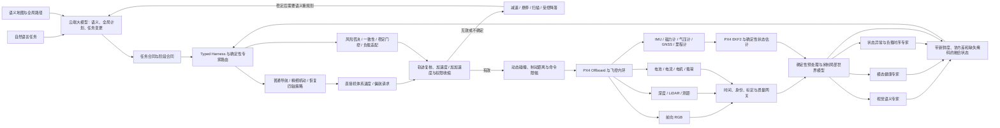

# DroneDream 多传感器大小模型协同设计方案

文档定位：早期详细设计与历史验证材料。后续目标架构、连续动作控制、学习路线和整体验收统一由 [自主飞行架构与整体交付总计划](AUTONOMY_ARCHITECTURE_MASTER_PLAN.md)规定。下文的旧候选路径、旧时序配置及对应成功数据只适用于原资产，不覆盖当前实施基线，也不能直接作为新包资格。

## 1. 文档目的

本文定义 DroneDream 后续多传感器自主飞行研发的目标架构、模型分工、延迟与空间预算、训练路径和准入标准。它面向真实的完整任务链：用户只给出自然语言目标，系统在已导入地图中完成长距离飞行、室内外切换、楼梯与门口等狭窄区域通过、取件悬停、负载变化、临时改址和返航，而不是把若干互不连通的演示拼在一起。

本文是设计基线，不把尚未通过仿真或真实飞行准入的能力描述成已经可用。后续实现必须用内容哈希、传感器合同、模型调用记录和完整任务证据证明能力真正接入。

当前源码、模型包、训练覆盖和最新失败的核对结果见 [连续控制升级实施基线](CONTINUOUS_CONTROL_UPGRADE.md)。当前直接控制候选实际有 9 个 ONNX 文件，完整闭环尚未通过。下文历史十专家包与候选轨迹飞行记录只证明当时的实现，不能作为当前连续控制权重的资格。

## 2. 决策摘要

最终采用三层协同，而不是让一个云端大模型直接输出电机指令：

1. **云端大模型负责长时间尺度认知**：理解自然语言、阅读全局地图、生成任务计划、解释检查点、处理用户改址、在复杂情况中重规划和复核任务是否完成。
2. **多个本地小模型负责连续感知和快速决策**：视觉语义、传感器健康、时序异常、负载动力学、普通导航、精细起降、风险否决和恢复控制；当前连续策略直接输出归一化的前/右/上速度与偏航速率轴，不再借离散候选坐标间接表示动作。
3. **确定性状态估计、几何规划、安全保护和 PX4 控制负责硬实时与最后安全边界**：校准、坐标变换、EKF 状态、占据空间、制动距离、候选轨迹生成、碰撞复核、命令限幅、失效悬停和受控降落。

这三层可以类比为：云端模型是负责理解任务和全局推理的大脑，本地专家是视觉、前庭、反射和小脑，PX4 与安全保护则是不可越过的脊髓反射和飞控底座。

最重要的原则是：**不是每一种传感器都必须配一个神经网络。** 摄像头语义、跨模态一致性和复杂时序模式适合学习模型；IMU、气压计、磁力计、GNSS、测距和深度的校准、物理单位转换与状态估计，应先由确定性算法和 PX4 EKF2 处理。学习模型可以评价、补充、发现异常和选择候选动作，但不能伪造测量值、扩大安全权限或替换硬安全控制。

## 3. 实现与历史验证记录

### 3.1 已经存在的能力

当前架构已经具备以下基础：

- 云端模型不在每个控制周期中被同步调用；长延迟只允许发生在遥测确认的稳定悬停之后。
- 本地 Harness 能按飞行阶段选择普通导航或精细机动专家，并请求独立的风险、感知健康、稳定性、负载和异常顾问。
- 已准入的上一代模型包仍使用离散短轨迹排序，因此只允许在本轮教师采集中作为影子观察者，不能取得执行权限。当前源码中的普通导航、精细和恢复策略改为直接输出带模型调用、传感器快照和期限绑定的机体系前/右/上速度与偏航速率请求。模型不生成世界坐标、电机 PWM、推力或不受限姿态指令。
- 原始测距、动态目标和飞行状态已有内容绑定编码器，使用标定量程、外参和相对速度。飞行状态编码器默认 16 帧、250 ms 最大间隔，但当前 worker 覆盖为 4 帧、5,000 ms；这项训练/运行合同差异已列入实施基线。缺失、过期与历史预热有门控，但不能据此声称完整原生传感器时序已验证。
- 深度观测、局部占据空间、未知空间阻断、静态和动态轨迹复核、20 Hz PX4 Offboard 指令链已经存在。
- 模型包已具备车辆、传感器合同、地图、张量签名和内容哈希绑定机制。
- `perception-encoder`、`precision-maneuver-policy`、`recovery-policy`、`state-anomaly-detector`、跨传感器一致性和时序负载动力学角色已经进入同一仿真准入包；每个角色仍受传感器新鲜度、车辆合同和确定性安全层约束。

现有控制路径详见 [architecture.md](architecture.md)。

### 3.2 历史候选轨迹模型包

迁移为连续控制之前的开发包包含 10 个被 ONNX Runtime 调用的本地专家，合计 3,490,218 个参数、14,014,000 字节模型文件。下表保留该历史包的记录；当前包的组成以实施基线和实际清单为准。

| 角色 | 参数量 | 文件大小 | 当前职责 |
| --- | ---: | ---: | --- |
| 前向视觉编码器 | 3,340,579 | 13,406,538 字节 | 读取机载前向 RGB，输出画面质量、场景、语义、可通行性和 139 维视觉特征 |
| 普通局部导航 | 41,748 | 168,526 字节 | 融合 46 维状态、最多 8 条确定性候选及视觉特征，选择短轨迹、动作类型和风险 |
| 精细机动策略 | 31,316 | 126,794 字节 | 在起飞、降落、悬停、检查点、取件和航点收敛阶段直接选择受限候选；不再回退给普通导航 |
| 恢复策略 | 20,884 | 85,066 字节 | 在卡滞、退化或恢复阶段从确定性恢复候选中选择动作，不能绕过安全复核 |
| 风险否决专家 | 20,163 | 81,449 字节 | 独立评价当前状态和候选轨迹风险，直接决定是否否决运动但不能扩大权限 |
| 感知权限专家 | 1,537 | 6,650 字节 | 以传感器新鲜度、覆盖、身份和质量决定感知风险和运动权限上限 |
| 稳定性门控专家 | 12,513 | 50,767 字节 | 在起飞、悬停、取件等待和降落等阶段决定是否允许阶段切换 |
| 状态异常检测 | 12,097 | 49,089 字节 | 检查连续状态历史中的跳变、漂移、失配和不稳定，只能触发更保守的权限 |
| 跨传感器一致性否决专家 | 2,113 | 8,968 字节 | 比较视觉、深度、定位、地图和新鲜度摘要，发现冲突并收缩运动权限 |
| 负载动力学适配 | 7,268 | 30,153 字节 | 使用 8 帧、每帧 24 维的载荷与 PX4 动力学历史，输出风险和控制步长缩放；仅在有效载荷回执与新鲜动力学同时存在时启用 |

该包绑定车辆合同、传感器合同、张量签名、模型内容哈希和仿真准入回执。十个模型文件保持逐字节不变，并已重新绑定到当前原生、经过 PX4/Gazebo 物理读回核验的飞行器合同；换绑回执本身不授予资格。随后完成的独立留出准入包含 75 个导航样本，运动授权准确率 98.67%、候选选择准确率 96.43%、危险悬停召回率 100%；负载动力学部分继承的是同一字节模型在 566 个独立验证样本（24 个危险、542 个安全）上的既有证据，危险悬停召回率和安全运动召回率均为 100%，风险平均绝对误差为 0.001693，控制步长缩放平均绝对误差为 0.022404。视觉预处理、视觉编码、导航和所有适用评论专家的组合 P99 为 30.268 ms。该包仍然只获得仿真使用资格，不具备真实飞行资格；当前飞行器绑定还必须完成新的端到端闭环复验。

视觉编码器不是随机初始化的占位网络。它采用 ImageNet 预训练 MobileNetV3-Large 骨干和 Lite R-ASPP 多任务头；最近一次独立验证包含 5,773 帧，语义像素准确率为 97.293%、八类平均 IoU 为 86.688%，最低类别 IoU 为 68.934%，可通行性平均绝对误差为 0.01695，场景与画面质量二分类准确率分别为 99.363% 和 100%。这些指标证明当前权重具备明确的视觉学习能力，但仍不能替代真实 OAK-D 光照、玻璃、反射、运动模糊和相机污染测试。

### 3.3 历史 PX4/Gazebo 闭环验证（不授予当前包资格）

- 前向机载 RGB 已经持续进入视觉编码器，不再只是保存截图；每一次成功调用都记录各专家的独立延迟、输入输出哈希、候选分数和最终权限。
- 最新时序负载专家复验在 PX4/Gazebo 中完成取件、载荷状态切换、返程和确认落地，运行状态为 `verified`，最终为 `ON_GROUND`。127 个 Harness 周期触发 118 次本地组合调用并实际应用 86 条模型授权路径；负载动力学专家在 48 个周期中读取 48 份各不相同且通过哈希绑定的 PX4 动力学样本。执行器、IMU、姿态和电池样本的最大年龄分别为 0.914、0.420、0.481 和 2.903 秒，均满足 3 秒上限；模型失败和超时均为零。该证据证明负载专家真实进入同一控制链，但仍只是仿真资格。
- 完整 PX4/Gazebo 往返覆盖办公室、走廊、多层楼梯、室外远端取件点、原路返回和办公室降落：路线 346.136 米、43 个世界航点，2,688 个 Harness 周期、2,294 次五专家组合调用、1,826 次模型授权路径实际应用，最终落地状态为 `ON_GROUND`，没有路线回退推进，也没有云端 token 消耗。
- 定向楼梯往返验证覆盖低纹理墙面导致的 RGB 质量退化：975 个 Harness 周期、861 次组合调用、660 次授权路径应用。RGB 被定义为可降级的语义指导，深度和车辆状态继续作为控制关键输入，因此局部低纹理不会再次触发无谓的提前降落。
- 五个 ONNX 会话使用单线程、顺序执行和共享图优化配置，避免五套默认线程池抢占 Gazebo 与传感器工作线程。同一路线复验的完整执行时间由 527.398 秒降至 391.906 秒，深度陈旧周期由 91 次降至 7 次；组合调用 P99 为 108.02 ms，最大值 125 ms，低于 250 ms 硬截止时间。
- 八专家短程 PX4/Gazebo 往返已经在“只于新鲜深度帧上接受结果”的严格门槛下通过：246 个 Harness 周期、235 次模型组合调用、189 次模型授权路径实际应用。普通导航直接处理 76 次，精细机动直接处理 149 次；10 次恢复请求因为独立恢复权重尚不存在而显式回退到普通导航。任务返航并以 `ON_GROUND` 落地，零碰撞、零路线回退推进、零模型调用失败或超时，也没有已完成结果因感知在复核边界过期而被丢弃。模型读取与视觉合同一致的 224×128 机载前向帧，整次组合调用 P99 为 153 ms、最大 165 ms，低于 250 ms 硬界限。
- 最新短程复验使用重新编译的 ROS 工作区和同一仿真准入包，完成 19.531 米、5 航点往返并以 `ON_GROUND` 落地。423 个 Harness 周期中发生 419 次本地组合调用、360 次模型授权路径实际应用；普通导航直接执行 138 次、精细机动直接执行 281 次，8 个已准入角色全部留下真实调用记录，模型失败和超时均为零。同步多模态记录器留下 1,291 条 RGB、深度、位姿和飞控状态记录，共 61,584,034 字节且无写入错误。路径切线朝向获得 1,695 个新鲜实测姿态样本，最大样本年龄 0.149 秒，绝对误差 P99 为 31.125 度，满足 45 度门槛。组合调用 P99 为 145 ms、最大 171 ms；本地模型使用逻辑 CPU 28–31，Gazebo、传感器和其余运行时使用 0–27，两个集合互斥且完整覆盖允许集合。该短程结果证明当时的本地闭环、同步记录、航向实测和 CPU 隔离可工作，但不能替代 413 米长航程、原生控制链路超时保护与负载阶段复验。
- 随后的长航程证据显示，2,733 次成功调用的端到端 P50 为 66 ms，但各专家计算 P50 合计仅 8.207 ms，未单独计时的图片处理和调度残差 P50 达 51.113 ms；P99 专家计算合计为 200.046 ms，证明问题不能靠放宽 250 ms 门槛掩盖。在线路径现在由传感器线程一次生成同源证据 PNG 和固定尺寸 RGB8 像素，模型不再把刚编码的 PNG 解码回来；视觉编码在确定性快照编译之前由容量为“一个正在执行、一个可替换待处理项”的最新值后台执行器提前启动。失败周期会保存总延迟、资格门槛、图片预处理、预取等待、后端和各专家的有界数值诊断，不记录图片或异常文本。
- 新路径先对失败长航程留下的全部 2,798 次模型输入完成离线回放：零调用失败，旧有 2,733 个成功输出逐个 SHA-256 完全一致，P50/P95/P99/最大调用延迟分别为 14.855/16.801/19.575/53.806 ms。随后在 PX4/Gazebo 同机负载下完成新的 19.531 米、5 航点往返：432 个 Harness 周期、427 次组合调用、371 次授权路径实际应用、零模型调用失败或超时，最终 `ON_GROUND` 且全部资格门通过。组合调用 P50/P95/P99/最大值为 1/9/37/81 ms；视觉 RGB8 预处理 P99 为 0.948 ms，预取等待 P99 为 0.005 ms，后台视觉编码器 P99 为 54.246 ms。普通导航、精细机动、视觉编码、风险、感知健康、稳定落定、状态异常和跨模态一致性八个角色均有真实调用。逻辑 CPU 28–31 继续只给本地模型，0–27 给其余运行时；终态后没有残留任务进程。该证据成为完整路线复验前的回归门槛。
- 最新完整路线复验已经通过：同一 School Map 上完成办公室出发、上层走廊、多层楼梯、底层通道、室外远端点、原路返楼、上楼和办公室复归，路线 346.136 米、43 个路线点，最终 `ON_GROUND`，全部资格门通过。轨迹阶段 3,369.48 秒，总 Offboard 阶段 3,447.03 秒；4,624 个 Harness 周期触发 4,489 次八专家组合调用，4,082 条模型授权路径和 36,990 次模型授权控制被执行，模型调用失败、模型超时和新鲜感知复核超时均为零。调用本身的 P50/P95/最大延迟为 1/30/169 ms，调用间隔 P50/P95 为 0.631/1.338 秒。滚动局部世界模型最终只保留 142,599 个实时证据体素，同时删除 5,878,897 个过期或远处体素；相比修复前被中止的同路线基线约 1,405,990 个常驻体素，长任务内存不再随累计里程无限增长。运行留下 57,734 个 Gazebo 位姿样本、16,885 行 ROS 原生观测和 9,668 条同步多模态记录，全部记录同时包含前向 RGB 与深度；其中 9,420 条还具备新鲜且完整的 IMU、姿态、电池和执行器动力学。路径切线朝向取得 16,505 个实测姿态样本，最大年龄 0.137 秒，绝对航向误差 P99 为 24.475 度，满足 45 度门槛。终态后 PX4、Gazebo、传感器和任务进程均已退出。
- 最新干净开发 Runtime 资源包为 83,876,573 字节，包含 72 个内容清单条目（另有清单文件本身）；其中本地专家目录含 13 个文件、14,023,432 字节。逐文件哈希、大小、遗漏文件和 Python 缓存检查全部通过，Runtime 解析器确认该目录只暴露一个 `simulation-only` 十专家包。

### 3.4 本轮实时控制链强化

当前源码已经把本地模型从“选择短轨迹坐标”迁移为直接请求实际控制量，而不是停留在解释文字：

- 每个新深度帧生成 40 维机体系测距特征、40 维相对动态目标特征和 20 维飞行状态时序特征，并为每一维保留独立有效掩码；三类编码结果均绑定原始内容哈希、采样时间、编码时间、质量、覆盖、不确定度和问题码。
- 测距特征只按传感器合同声明的固定量程归一化，并先应用 `orientation_body_from_sensor` 外参；不会因当前画面没有远处目标而改变尺度。覆盖率按传感器声明视场计算，73° 前向深度相机不会因看不到机尾方向而被误判成 360° LiDAR 故障；视场外空间仍保持未知和阻断。Gazebo/光学本体的前—左—上坐标只在控制边界转换一次为公开的前—右—上语义，超出标定量程的样本不会进入控制。
- 动态目标闭合速度以“目标世界速度减无人机世界速度”计算，再转换到机体系；特征同时携带距离、闭合速度、TTC、置信度和目标年龄。
- 飞行状态需积累满配置窗口的严格递增样本；默认配置与当前 worker 覆盖值的差异见实施基线。样本间隔超限、历史预热、必需编码器过期、低质量或覆盖不足会使 `ready_for_control=false`，随即撤销模型运动授权。
- 连续策略的四轴头直接输出归一化的前/右/上速度和偏航速率，绑定来源专家、模型调用 ID、传感器快照 SHA-256 和短期限；车辆合同把轴幅度映射为物理速度，最新姿态负责把机体系请求转换回世界 ENU。随后再次施加速度、加速度、加加速度、静态/动态碰撞与净空限制。
- 如果确定性安全层改变了模型请求，证据明确标为 `deterministic-safety-override`；只有原始模型速度确实被保留时才标为 `local-model-body-control`。PX4 执行器也只在后一种情况下积分模型偏航速率。
- 雷达已进入传感器合同；为了保持已经准入的 64 维策略张量不变，其健康信息与 LiDAR 归入同一“几何测距”通道，实际雷达目标必须先以米、世界速度、时间与置信度进入动态目标融合，不能伪装成 RGB 或深度值。

可重复基准使用 320 条测距射线、16 个动态目标和 16 帧飞行状态历史执行 950 次计时样本。整条编码与融合路径 P50/P95/P99 分别为 3.428/3.838/4.222 ms，最大值 23.249 ms，通过 P99 不高于 10 ms、最大值不高于 100 ms 的源码门槛。基准收据见 [realtime-feature-control-benchmark.json](../evidence/realtime-feature-control-benchmark.json)。本轮完整 Python 回归为 937 项全部通过，静态检查全部通过。

上述基准与回归数字对应记录时的源码。之后已生成连续控制候选并执行新的 PX4/Gazebo 试验，结果为失败；暂停前还有未测试的补丁。当前状态与缺口以实施基线为准，不能继承历史包资格。

### 3.5 当前缺口

- 深度、定位、IMU/EKF 等信息已经过确定性处理进入共享状态；PX4 侧持续采集 IMU、姿态、电池和执行器输出，负载专家使用 8 帧、每帧 24 维的真实动力学历史。订阅流中断、报错或连续 3 秒没有新样本时，数据立即变为过期并触发有上限的重建；有效载荷回执、新鲜动力学和合格负载权重缺一时都必须保持，不能静默退回无负载控制。当前权重、独立留出准入和短程完整闭环已经通过，下一步缺口是真实机体传感器校准、台架载荷变化和分阶段飞行资格，而不是继续把仿真准入外推为真实飞行能力。
- 长航程的 CPU 隔离、视觉关键路径、滚动局部地图、实测航向和模型失败门槛已经由上述完整路线覆盖。仍需继续降低仿真宿主机上的控制发布抖动：完整路线的安全命令生成间隔 P50/P95 为 0.248/0.566 秒，12,026 个相邻生成间隔中有 440 个超过当前 600 ms 短租约。执行器在这些空窗内按合同固定位置保持，记录 755 个 `command-unavailable` 控制周期，最长连续保持 0.77 秒；没有超过 8 秒失效边界、没有触发降落且最终任务通过。下一步应优先把深度融合、证据写盘和命令续签进一步解耦或降低跨文件系统 I/O 延迟，不能只为消除数字而放宽安全期限。
- Harness 已能按阶段直接选择普通、精细和恢复策略，并让风险、感知健康、稳定落定、状态异常、跨模态一致性和负载动力学评论独立收缩权限。恢复专家已进入当前仿真准入包，但仍需在更多独立动态障碍、卡滞和传感器退化任务中扩大事件覆盖，才能评估相对确定性恢复逻辑的真实增益。
- 当前已验证闭环策略周期依任务配置为 0.5–1.0 秒。它能完成现有低速路线，但尚未达到设计中的普通导航 5–10 Hz、精细/恢复 10–20 Hz 目标。
- 当前成功证据来自 School Map，尚未达到不少于 20 个独立完整任务、多地图、动态障碍、真实负载和临时改址的正式仿真活动门槛。
- 真实 OAK-D、真实飞控和真实机体仍需经过台架、系留、低速分阶段与受控场地验证；仿真通过不能继承为真实飞行资格。
- 安装空间已有模型和 Runtime 内容清单约束，但地图、用户证据、日志和下载缓存的 48 GB 总硬配额仍需在安装版中自动执行。
- 本轮机体系控制链必须先重新构建开发 Runtime，并依次通过回放、短程 PX4/Gazebo、完整长程、动态障碍、负载变化、临时改址和故障注入；在这些步骤完成前，既有十模型包仍是当前唯一仿真准入包。

## 4. 设计边界

### 4.1 模型可以做什么

- 从 RGB 中提取门、楼梯、人员、玻璃、通道、可通行区域和取件区域等语义。
- 评价深度、LiDAR、RGB、定位和状态估计是否健康、一致、及时。
- 结合粗路线方向和实时融合状态，直接生成短时、机体系、可撤销的前/右/上速度与偏航速率请求；加速度、加加速度、净空和最终执行权仍由确定性层限制。
- 建议减速、缩短前视距离、悬停、扫描、局部重规划或进入恢复流程。
- 针对起飞、穿门、楼梯、取件悬停、负载接入和降落选择更保守的精细策略。
- 在任务中止点或用户改址时，为云端模型准备紧凑、可审计的事实摘要。

### 4.2 模型永远不能做什么

- 直接输出电机 PWM、推力或不受限的姿态率；当前只允许输出上层有界速度和偏航速率请求。
- 把 RGB 推测出的空间当成经过测量的自由空间。
- 在缺失、陈旧或身份不匹配的传感器数据上继续运动。
- 降低确定性代码已经计算出的碰撞净空、制动距离或载荷限制。
- 用高置信度覆盖硬传感器故障、坐标错误或 PX4 拒绝。
- 在真实飞行过程中边飞边训练或在线修改生产模型权重。

PX4 的碰撞保护本身也采用保守原则：传感器覆盖不足会限制运动，多来源在同一方向给出障碍信息时使用更小的距离，并把传感器与速度跟踪延迟纳入制动计算。DroneDream 的上层保护应保持同一方向，而不是绕过它。[PX4 Collision Prevention](https://docs.px4.io/main/en/computer_vision/collision_prevention)

## 5. 传感器的互补、重叠与独立关系

融合不能只是把所有数组拼接后交给一个模型，也不能简单平均。每种测量必须携带时间、坐标系、单位、协方差、有效范围和健康状态。

| 传感器或来源 | 主要提供 | 典型弱点 | 与其他来源关系 | 权威处理路径 |
| --- | --- | --- | --- | --- |
| 前向 RGB 摄像头 | 物体和场景语义、纹理、门、人员、标志、通道类型 | 单目尺度不确定，逆光、黑暗、模糊、玻璃和遮挡 | 与深度互补；与语义地图相互校验 | 本地视觉编码器提供语义，不单独确认净空 |
| 双目深度 / RGB-D | 米制距离、点云、局部自由空间 | 低纹理、反光、透明物、过近或过远区域可能失效 | 与 RGB 语义互补；与 LiDAR 几何重叠 | 确定性深度投影与占据网格是碰撞主依据 |
| LiDAR / 距离扇区 | 几何距离、形状和方向覆盖 | 语义弱，受反射率、雨雾、扫描盲区影响 | 与深度几何重叠，可形成冗余；与 RGB 互补 | 确定性扇区或体素融合，必要时加轻量点云专家 |
| 加速度计和陀螺仪 | 高频姿态变化、角速度、线加速度 | 积分漂移、振动、温漂和偏置 | 与 GNSS、视觉里程计、气压计互补 | PX4 EKF2 和飞控内环为权威；时序模型只做异常评论 |
| 磁力计 | 航向参考 | 室内金属和电机电流干扰 | 与外部视觉航向、GNSS 航向互补 | EKF2 融合并输出创新量；异常专家可请求降级 |
| 气压计 | 相对高度和垂直趋势 | 天气、室内气流和螺旋桨下洗影响 | 与下视测距、GNSS 高度和视觉高度互补 | EKF2 高度融合，近地阶段优先检查测距 |
| GNSS | 户外绝对位置、速度和时间 | 室内不可用，多路径和遮挡 | 与 IMU、视觉里程计和地图定位互补 | EKF2 按质量门槛接纳；室内必须允许安全失效 |
| 视觉/激光里程计 | 局部相对位姿和运动 | 纹理退化、动态场景和累计漂移 | 与 IMU、GNSS 和地图匹配互补 | 作为带协方差的外部视觉输入 EKF2 |
| 下视测距 / 光流 | 近地高度、平面相对速度 | 有效高度和表面纹理受限 | 与气压计、IMU 和外部视觉互补 | 起降和悬停阶段的专门确定性门控 |
| 电池、电流、电机转速、推力 | 能源、执行器负荷、动力余量 | 单独不能说明位置或净空 | 与 IMU、载荷状态组合反映动力学变化 | 硬阈值保护加负载动力学专家 |
| 载荷接入和保管回执 | 是否挂载、质量估计、稳定时间 | 需要真实事件或传感器证据 | 与电流、IMU、悬停误差互补 | 有回执后才允许启用负载专家 |
| 语义地图和全局路线 | 宏观拓扑、区域用途、已知静态结构 | 可能陈旧，不代表临时障碍 | 与所有在线传感器互补 | 只提供先验；在线观测可以使其更保守 |

PX4 EKF2 的官方合同说明了为什么不能用一个神经网络替代这些基础融合：IMU 至少需要 100 Hz，磁力计和高度来源至少需要 5 Hz；外部视觉需要位置、速度或姿态以及协方差，光流还需要有效测距和质量指标。[PX4 EKF2](https://docs.px4.io/main/en/advanced_config/tuning_the_ecl_ekf)

## 6. 目标架构



### 6.1 传感器合同网关

所有传感器消息在进入世界模型前必须标准化为不可省略的合同：

```text
sensor_id
vehicle_id
sequence
sample_monotonic_time
receive_monotonic_time
coordinate_frame
unit
intrinsics_sha256
extrinsics_sha256
calibration_sha256
covariance_or_quality
valid_range
payload_sha256
freshness_deadline
```

网关执行以下硬检查：

- 单调时间和序号是否倒退；
- 采样时间与接收时间的延迟是否超过该模态预算；
- 车辆、相机和飞控身份是否一致；
- 坐标系、外参、内参、单位和有效距离是否匹配；
- 数据是否出现全黑、全白、冻结帧、NaN、无穷、恒定深度或不可能跳变；
- 质量不合格的数据可以记录，但不能被学习模型重新解释成健康数据。

OAK 设备支持设备时间与主机时间同步，也能把 RGB、深度和 IMU 作为同步管线处理，因此在真实硬件接入时应保留设备时间戳而不是只使用主机接收时间。[Luxonis Device Time Sync](https://docs.luxonis.com/software-v3/depthai/depthai-components/device) [Luxonis RGB/Depth Sync](https://docs.luxonis.com/software/depthai/examples/depth_video_sync)

### 6.2 确定性标准化与局部世界模型

世界模型是一个异步更新、带时间和不确定度的紧凑共享状态，而不是一个要求所有传感器同时到达的大张量。它至少包含：

- 当前位姿、速度、姿态、协方差和 EKF 创新量；
- 以无人机机体和任务目标为参考的三维局部占据空间；
- 各方向最近障碍、观测覆盖、未知空间和制动余量；
- RGB 语义特征、检测物体、可通行性和对应深度；
- 每种模态的新鲜度、置信度、失效原因和最近恢复时间；
- 当前任务阶段、目标点、候选轨迹、负载状态和动力余量；
- 全局地图摘要和与在线观测的冲突。

世界模型采用“最后一个仍在有效期内的样本”，每种模态有独立期限。不得为了等待慢摄像头而阻塞 IMU 或飞控，也不得把一秒前的视觉结果与当前位姿直接拼接。

## 7. 本地专家模型组合

下表中的参数量、INT8 大小和延迟是设计上限或候选范围，不是尚未测量就承诺的实测值。最终选择必须在 DroneDream 支持的实际硬件上完成同一数据集、同一预处理和同一 ONNX Runtime 路径的竞争测试。

| 专家 | 建议结构 | 输入 | 输出 | 参数量目标 | INT8 文件目标 | 单次 P95 目标 | 典型频率 | 安装策略 |
| --- | --- | --- | --- | ---: | ---: | ---: | ---: | --- |
| RGB 语义编码器 | MobileNetV3-Large + Lite R-ASPP，多任务头 | 前向 RGB | 场景特征、可通行性、门/楼梯/人员/玻璃概率 | 6–12M | 8–35 MB | CPU ≤ 40 ms；加速器 ≤ 20 ms | 10–15 Hz | 核心视觉包 |
| RGB 物体检测器 | RTMDet-tiny 候选 | 前向 RGB | 人员、动态物、门区、取件标志框及置信度 | 4–8M | 8–35 MB | ≤ 60 ms | 5–10 Hz 或事件触发 | 可选；语义头无法满足召回率时才安装 |
| 深度几何处理 | 确定性投影、体素、地面/近场分离 | 校准深度 | 米制点云、占据、净空、未知空间 | 无神经参数 | 无 | ≤ 25 ms | 20–30 Hz | 核心代码 |
| 深度质量门控 | 小型 MLP 或 TCN | 深度统计、有效像素、边缘、曝光、历史 | 健康、退化、冻结、风险分数 | 0.1–0.5M | ≤ 2 MB | ≤ 5 ms | 20–30 Hz | 核心模型包 |
| LiDAR 几何处理 | 确定性扇区/体素融合 | 点云或距离扇区 | 局部占据、最近距离、覆盖 | 无神经参数 | 无 | ≤ 25 ms | 10–30 Hz | 对应传感器包 |
| LiDAR 物体专家 | 轻量 PointPillars 候选 | 去畸变点云 | 三维物体和运动线索 | 3–8M | ≤ 40 MB | ≤ 50 ms | 10–20 Hz | 只有真实 3D LiDAR 且证明收益后启用 |
| 状态异常专家 | 小型 TCN，GRU 作为竞争候选 | IMU、EKF 创新、GNSS、气压、磁航向时序 | 偏置、漂移、振动、失配风险 | 0.2–1M | ≤ 4 MB | ≤ 5 ms | 20–50 Hz | 核心模型包 |
| 跨模态一致性否决 | 掩码感知 MLP/TCN | RGB、深度、LiDAR、EKF、地图的紧凑特征 | 一致性、冲突来源、权限上限 | 0.5–2M | ≤ 8 MB | ≤ 10 ms | 10–20 Hz | 核心模型包 |
| 负载动力学专家 | 小型 TCN | IMU、推力、电流、电机、悬停误差、载荷回执 | 载荷变化、稳定性、速度/前视缩放 | 0.2–1M | ≤ 4 MB | ≤ 5 ms | 20–50 Hz | 核心模型包；有回执才激活 |
| 普通局部导航 | 掩码感知 MLP/TCN 连续策略 | 融合状态、粗路线的机体系参考 | 前/右/上速度轴、偏航速率轴、动作类别和风险 | 0.1–2M | ≤ 8 MB | ≤ 5 ms | 5–10 Hz | 核心模型包 |
| 精细机动 | 独立连续小策略 | 精细阶段状态、局部几何和机体系参考 | 更低幅度的四轴起飞、穿门、悬停和降落控制 | 0.1–2M | ≤ 8 MB | ≤ 5 ms | 10–20 Hz | 核心模型包 |
| 恢复策略 | 独立连续小策略 | 卡滞、障碍、退化状态和粗路线参考 | 有界后退、升高、侧移、转向、扫描或降落动作 | 0.1–2M | ≤ 8 MB | ≤ 5 ms | 事件触发，触发后 10–20 Hz | 核心模型包 |
| 风险否决专家 | 现有模型逐步增强 | 融合状态与候选 | 风险和否决 | 0.1–1M | ≤ 4 MB | ≤ 5 ms | 与策略同步 | 核心模型包 |
| 感知权限专家 | 现有模型逐步增强 | 每模态健康与覆盖 | 运动权限或否决 | 0.1–1M | ≤ 4 MB | ≤ 5 ms | 10–30 Hz | 核心模型包 |
| 稳定性门控专家 | 现有时序模型逐步增强 | 姿态、速度、振动、距离历史 | 是否允许起飞/悬停/挂载/降落切换 | 0.1–1M | ≤ 4 MB | ≤ 5 ms | 20–50 Hz | 核心模型包 |

### 7.1 视觉模型首选

视觉第一选择不是云端视觉大模型，而是**本地 MobileNetV3-Large + Lite R-ASPP 多任务编码器**：

- MobileNetV3 是按移动端 CPU 延迟搜索的架构，论文同时覆盖检测和语义分割，并提出轻量 Lite R-ASPP 解码器，适合当前“参数不必最小，但必须快且效果优先”的要求。[MobileNetV3 原始论文](https://openaccess.thecvf.com/content_ICCV_2019/html/Howard_Searching_for_MobileNetV3_ICCV_2019_paper.html)
- 一个共享骨干同时输出场景嵌入、可通行性和关键语义，比同时常驻多个重复视觉骨干更节省内存和预处理时间。
- MobileNetV3-Small 只作为低端 CPU 的降级候选，不作为默认质量基线。

同时保留两个竞争候选，而不是在纸面上直接决定胜负：

- **EfficientFormerV2-S0** 作为质量挑战者。其原始论文目标就是在接近 MobileNet 的参数和延迟范围内提高准确率，但论文硬件结果不能代替本机 ONNX 实测。[EfficientFormerV2 原始论文](https://openaccess.thecvf.com/content/ICCV2023/html/Li_Rethinking_Vision_Transformers_for_MobileNet_Size_and_Speed_ICCV_2023_paper.html)
- **Fast-SCNN** 作为低内存实时分割挑战者。原始论文专门面向嵌入式高分辨率语义分割。[Fast-SCNN 原始论文](https://arxiv.org/abs/1902.04502)

只有当共享语义编码器对人员、临时障碍或特定取件标志的召回率达不到安全门槛时，才额外安装 RTMDet-tiny 检测器。RTMDet 原论文提供 tiny 到更大规模的速度/准确率选择，但最终权重许可、ONNX 算子覆盖和 DroneDream 硬件延迟仍要单独审核。[RTMDet 原始论文](https://arxiv.org/abs/2212.07784)

### 7.2 深度和 LiDAR 的选择

深度和 LiDAR 首先是几何测量，不应一开始就用神经网络替换：

- OAK-D Lite 本身具有 RGB、双目深度和六轴 IMU，并提供设备侧立体深度和神经推理能力；优先把深度投影、对齐和基础视觉推理放到设备侧或本地，避免发送到云端。[OAK-D Lite 官方规格](https://docs.luxonis.com/hardware/products/OAK-D%20Lite) [OAK-D Lite 计算规格](https://checkout.luxonis.com/products/oak-d-lite-1)
- Luxonis 明确把设备侧深度用于米制三维感知、映射和导航，同时也说明低纹理和反光等场景仍可能有挑战，因此深度必须带质量与有效范围，而不能被当作永远正确。[Luxonis Depth](https://docs.luxonis.com/overview/toplevel-features/depth)
- 如果将来安装真实 3D LiDAR，先用确定性体素和距离扇区；只有在需要三维物体检测且证明任务成功率提升时，才引入 PointPillars 类轻量编码器。PointPillars 原始工作展示了把点云组织成柱状特征后使用二维卷积的实时设计，但论文的车载基准速度不等于本项目硬件速度。[PointPillars 原始论文](https://openaccess.thecvf.com/content_CVPR_2019/papers/Lang_PointPillars_Fast_Encoders_for_Object_Detection_From_Point_Clouds_CVPR_2019_paper.pdf)

### 7.3 IMU、姿态和负载时序模型

IMU、气压、磁航向、电流和推力属于高频时序信号。建议以小型 TCN 为默认起点，GRU 作为竞争候选：

- TCN 可以并行处理固定窗口，张量形状稳定，易于导出 ONNX 和限制推理时间。
- 原始 TCN 评估表明卷积序列模型是循环网络以外的合理起点，但 DroneDream 必须用自己的飞行数据决定 TCN 与 GRU 的胜负。[TCN 原始论文](https://arxiv.org/abs/1803.01271)
- 时序专家不输出姿态估计，只输出异常概率、来源、建议速度上限和是否需要悬停。

## 8. 融合方法

### 8.1 分层融合而不是一个巨型模型

采用三段式融合：

1. **测量级融合**：PX4 EKF2 和确定性几何算法融合可用的物理测量与协方差。
2. **特征级融合**：RGB、深度、LiDAR、状态和负载专家输出固定维度的紧凑特征以及置信度。
3. **决策级融合**：导航专家根据融合状态与粗路线参考直接输出机体系速度/偏航请求，独立否决与门控模型保持或收缩权限；确定性安全层复核实际请求并记录方向覆盖或制动。

不使用一个常驻的大型多模态 Transformer，原因是：它会把所有模态的延迟、缺失和故障耦合到同一个黑盒中，难以证明哪个传感器导致了决定，也难以在低端硬件上稳定满足截止时间。

### 8.2 缺失模态和冲突处理

每个专家输出：

```text
feature_vector
confidence
aleatoric_or_measurement_uncertainty
sample_age_ms
coverage
health_state
issue_codes
source_hashes
```

融合器同时接收 `modality_present_mask` 和 `modality_healthy_mask`。训练必须包含单模态缺失、随机延迟、冻结、噪声和标定偏移。缺失模态鲁棒性不能只靠运行时填零；RGB-D 研究也显示，专门的缺失模态训练会显著影响退化表现，因此 DroneDream 必须把传感器丢失作为正式测试维度。[WACV 缺失模态研究](https://openaccess.thecvf.com/content/WACV2024/papers/Maheshwari_Missing_Modality_Robustness_in_Semi-Supervised_Multi-Modal_Semantic_Segmentation_WACV_2024_paper.pdf)

冲突不采用平均：

- RGB 认为通道可行、深度或 LiDAR 发现近障碍：几何否决，立即减速或悬停。
- 地图认为自由、在线深度发现障碍：在线测量让路线更保守。
- 深度认为自由、RGB 识别玻璃：保持未知或危险，不允许 RGB 降低净空。
- GNSS 与视觉里程计冲突且创新量异常：降低绝对定位信任，悬停并请求重定位。
- 气压高度与下视测距冲突：近地阶段优先进入精细门控，不直接继续下降。
- IMU、电流和推力显示负载突变但无载荷回执：视为未知动力学事件，禁止加速。

### 8.3 Harness 路由规则

Harness 根据任务阶段、传感器清单和健康状态只启用相关专家：

```text
if any hard contract is stale, mismatched or invalid:
    deterministic_hold_or_land()
else:
    world = update_metric_world_model()
    experts = [risk, perception_health, cross_modal_consistency]

    if rgb_is_qualified_and_fresh:
        experts += [rgb_semantics]
    if phase in [takeoff, doorway, stairs, hover, pickup, landing]:
        navigation = precision_maneuver
        experts += [settle_stability]
    else:
        navigation = general_navigation
    if verified_payload_receipt_exists:
        experts += [payload_dynamics]
    if state_history_is_long_enough:
        experts += [state_anomaly]
    if progress_stall_or_dynamic_obstacle_episode:
        navigation = recovery_policy

    proposal = navigation(fused_features, coarse_route_reference)
    authority = conservative_aggregate(proposal, experts)
    execute_only_after_static_dynamic_and_braking_recheck(authority)
```

“保守聚合”定义为：任何否决、门控或适配专家都可以提高风险、降低速度、缩短前视、要求扫描或否决，但不能独自增加速度、降低净空、延长命令租约或打开未知空间。

## 9. 多时间尺度协同

| 层 | 目标频率或触发条件 | 允许的工作 |
| --- | --- | --- |
| 飞控 IMU 与姿态估计 | 100–400 Hz，按硬件和 PX4 配置 | 姿态、偏置、速度与位置状态估计 |
| PX4 内环与 Offboard setpoint | 20–100 Hz；当前执行链为 20 Hz | 追踪已验证 setpoint、限幅、悬停、降落 |
| 深度/LiDAR 局部安全 | 20–30 Hz 目标 | 更新占据、制动余量、最近障碍和硬否决 |
| 状态异常与负载时序 | 20–50 Hz 目标 | 异常、稳定性和动力余量门控 |
| RGB 语义 | 10–15 Hz 目标 | 场景语义和可通行性，不阻塞更快的几何链 |
| 局部专家策略 | 普通 5–10 Hz；精细/恢复 10–20 Hz 目标 | 根据新鲜融合状态输出连续机体系速度与偏航速率 |
| 云端大模型 | 任务开始、语义检查点、用户改址、局部无法解决、任务复核 | 长时规划和自然语言推理；只能在稳定悬停后等待 |

当前已准入包的模型重规划周期依任务配置约为 0.5–1.0 秒；一个仍然有效的模型路径租约会在每个新鲜深度帧重新生成机体系控制请求并接受安全复核，而不是在两次模型调用之间盲目复用世界坐标。进一步把模型本身提升到上述频率前，仍必须完成组合 ONNX 路径和完整世界模型的实测，不能因为单个模型文件很小就直接调高。

## 10. 延迟与截止时间预算

### 10.1 关键路径目标

- 传感器采样到局部世界模型可用：P95 ≤ 40 ms。
- 世界模型到本地专家、否决和门控完成：P95 ≤ 60 ms。
- 本地学习链整体：P95 ≤ 100 ms，P99 ≤ 150 ms。
- 单次本地模型调用硬超时继续保持 250 ms；到期立即丢弃结果，不能在队列中迟到后继续执行。
- 任何结果都必须在执行前重新检查对应的位姿、候选轨迹和传感器哈希；状态变化后旧结果自动失效。
- 云端调用不设在运动关键路径中。需要云端时，先由遥测确认速度和姿态稳定，再发请求。

以 1 m/s 飞行为例，100 ms 已移动约 0.1 m，250 ms 已移动约 0.25 m；安全净空还必须叠加感知延迟、控制跟踪延迟、制动距离、机体半径、载荷摆动和定位不确定度。速度越高，可接受的感知年龄越短，而不是固定使用一个超时值。

### 10.2 调度规则

- 每个模型一个深度为 1 的“最新数据邮箱”，新帧覆盖未开始的旧帧，禁止无界排队。
- 视觉推理使用固定输入尺寸和预分配缓冲区；RGB 预处理只做一次，供多个视觉头复用。
- 独立专家可并行，但同一 GPU/NPU 的并行度需要实测，避免资源争用使尾延迟变差。
- 路由器维护每个模型的滑动 P50/P95/P99、冷启动、内存峰值和超时；超过资格门槛立即使该包失去运动资格。
- 性能报告必须区分纯 ONNX 推理、预处理、数据复制、世界模型、后处理和整个 Harness 调用，不能只报告最小的单模型时间。

## 11. 模型体积、安装与总空间预算

目标是除 WSL Runtime 之外的 DroneDream 相关安装、模型、地图、日志、下载缓存和保留证据总计不超过 50 GB。建议把硬配额设置为 48 GB，保留 2 GB 安全余量：

| 类别 | 硬配额 |
| --- | ---: |
| Windows 应用与本地依赖 | 4 GB |
| 核心官方本地模型 | 0.5 GB |
| 所有可选传感器模型包 | 1.5 GB |
| 地图、BIM、纹理和仿真资产 | 15 GB |
| 用户地图专用专家 | 5 GB |
| 运行日志、图像和资格证据 | 18 GB |
| 更新与可恢复下载缓存 | 2 GB |
| 预留空间 | 2 GB |
| 合计 | 48 GB |

额外规则：

- 核心官方学习模型总量不超过 500 MB；正常情况下设计目标应远低于此值。
- 单个可选传感器模型包不超过 750 MB，安装器按实际传感器清单下载，不预装无用 LiDAR、雷达或特定加速器资源。
- 所有官方模型包总量不超过 2 GB；所有地图专用模型合计不超过 5 GB。
- 本地学习运行时的额外常驻内存目标不超过 2 GB，低端档应能在 CPU 上安全降级。
- 原始高频图像和 PX4 ULog 是长期空间的主要风险。未被资格证据引用的普通运行数据按配额滚动清理；被资格收据、用户实验或故障调查引用的证据先压缩并显式保留，不能被普通缓存清理器误删。
- 模型文件、地图、标定和资格收据均以内容哈希去重。硬件编译缓存可重新生成，超出配额时优先清理。

## 12. ONNX 与硬件执行

训练框架不是产品运行时。所有主机侧模型以 ONNX 作为可审计的规范表示，硬件特定产物由它派生：

- NVIDIA：TensorRT 或 CUDA Execution Provider，CPU 回退。
- Intel CPU/GPU/NPU：OpenVINO Execution Provider，CPU 回退。
- 通用 Windows：优先评估 WinML；已有路径可继续评估 DirectML，CPU 为最终回退。
- OAK-D Lite：可把视觉骨干转换成设备侧 DepthAI blob；ONNX、转换工具版本、blob 和数值一致性报告都要哈希绑定。

ONNX Runtime 的 Execution Provider 会按优先顺序把可支持子图分配给加速器，并让默认 CPU 处理回退算子，因此模型准入必须记录实际使用的 Provider，不能只记录请求的 Provider。[ONNX Runtime Execution Providers](https://onnxruntime.ai/docs/execution-providers/) [ONNX Runtime 架构](https://onnxruntime.ai/docs/reference/high-level-design.html)

量化策略：

- CNN 视觉模型先做有代表性校准集的静态 INT8 量化。
- RNN/Transformer 候选先测试动态量化；TCN 也要同时比较静态量化和 FP16/FP32。
- 每个量化模型必须重新评估召回率、校准误差、跨模态一致性和完整任务成功率。
- 如果后训练量化达不到精度门槛，再使用量化感知训练，而不是为了体积强行接受精度下降。

以上选择与 ONNX Runtime 官方建议一致：CNN 通常优先静态量化，RNN 和 Transformer 通常优先动态量化，但仍需按模型和硬件验证。[ONNX Runtime Quantization](https://onnxruntime.ai/docs/performance/model-optimizations/quantization.html)

## 13. 数据与训练方案

### 13.1 数据记录

每次完整仿真以同一时钟记录：

- 原始或可复现的 RGB、深度、LiDAR、IMU、磁力计、气压计、GNSS、里程计；
- 相机内外参、坐标树、设备时间、接收时间和质量；
- PX4 状态、EKF 创新、setpoint、执行器、电池、电流和 ULog；
- 确定性局部世界、候选轨迹、净空、制动余量和未知空间；
- 模型前提案、每个否决/门控模型输出、机体系控制请求、安全覆盖、最终权限和实际执行；
- 地图、车辆、传感器、载荷、天气、纹理和随机化种子；
- 碰撞、擦碰、卡滞、提前落地、过冲、振荡、丢帧、误定位和成功证据。

### 13.2 训练数据划分

- 按完整地图、完整任务和完整飞行批次划分训练、验证、测试，禁止把同一飞行相邻帧随机分到不同集合。
- 负载动力学开发采集在训练和留出验证两侧各至少使用两个互不重叠的完整任务；单次任务即使包含大量相邻帧，也不能替代任务级来源多样性。
- 通用模型必须保留完全未见地图；地图专用模型必须保留该地图上未见路线、光照、障碍和载荷。
- 失败、近失、传感器退化和恢复样本必须有独立覆盖，不能被大量平稳直线飞行淹没。
- 精细机动按起飞、门口、楼梯、悬停、挂载、降落分别报告；整体均值不能掩盖某一阶段失败。

### 13.3 训练顺序

1. 使用仿真真值训练视觉语义、深度健康、状态异常和负载专家。
2. 用确定性规划器和安全控制器完成教师任务，记录实际发送的速度、偏航及执行状态，训练普通导航和精细策略；每个控制轴需要对应的执行证据。
3. 让学生策略在仿真中执行，收集它实际访问的困难状态，再由教师重新标注，采用 DAgger 类数据聚合降低闭环分布偏移。DAgger 的原始动机正是序列决策中后续观测依赖先前动作，普通独立同分布训练会失效。[DAgger 原始论文](https://proceedings.mlr.press/v15/ross11a.html)
4. 训练恢复策略时只使用具有稳定事件身份且后来证明真正恢复进展的样本。
5. 对 CNN、TCN 和候选视觉骨干量化，完成独立模型与组合 Harness 评估；量化前后必须重跑控制输出一致性和安全召回门槛。
6. 只在离线仿真和审核过的数据上做强化学习或策略微调；真实飞行期间权重只读。

### 13.4 域随机化和仿真到现实

视觉随机化至少覆盖光照、曝光、阴影、玻璃、反射、纹理、天气、运动模糊、压缩、脏镜头和遮挡。几何与状态随机化至少覆盖深度噪声和孔洞、LiDAR 丢点、相机外参偏差、IMU 偏置和振动、磁干扰、GNSS 漂移、气压漂移、风、推力差异、电池下降、质量和摆动载荷。

真实迁移按“传感器台架回放 → 系留或保护场地 → 低速单阶段 → 完整任务”推进，不能从 Gazebo 通过直接跳到开放环境。

## 14. 通用模型与地图专用模型

每个用户始终保留一个可回滚的通用专家包；地图专用包只在精确匹配以下内容时启用：

- 语义地图内容哈希；
- 车辆和传感器合同哈希；
- 相机和 LiDAR 标定哈希；
- 通用基座模型哈希；
- 资格收据和实际硬件档位。

地图专用训练只能调整地图相关的候选排序、场景先验和速度/精细阶段参数，不能关闭硬安全、把未知空间变自由或删除通用回滚。地图、标定或基座变化后，旧专用包自动失去资格。

## 15. 云端大模型与本地专家如何协同

以“办公室出发，经楼梯和大门，到取件柜悬停挂载，再送到新地点”的任务为例：

1. 云端大模型理解“取件、等待、挂载、送达”语义，阅读全局地图和车辆限制，形成可确认的任务阶段、路线走廊、检查点和失败条件。
2. 起飞时本地 Harness 选择精细机动、稳定落定、感知健康和风险专家；深度和下视测距提供近地几何，IMU/EKF 提供姿态与速度。
3. 沿走廊飞行时普通导航目标以 5–10 Hz 输出连续速度和偏航速率；深度安全更高频地检查临时障碍，RGB 语义识别门、人员或玻璃。频率与识别能力须由当前模型实测。
4. 接近门和楼梯时 Harness 切到精细策略，使用更精细的控制幅度与时限。RGB 说“像通道”但深度净空不足时，几何立即否决。
5. 到取件点后稳定评论必须证明速度、姿态和振动满足悬停条件。等待期间若收到真实载荷回执，负载专家结合电流、推力和 IMU 判断质量变化是否稳定，并只能降低后续速度或前视。
6. 用户临时改送达地点时，本地系统先保持当前安全控制；云端模型重新解释任务和全局路线，只有新计划通过合同、地图和安全验证后才原子切换。
7. 本地出现无法解释的定位冲突或持续卡滞时，先悬停和扫描；仍无法解决才把紧凑证据交给云端重规划。云端响应期间无人机不盲飞。正常运动期间，每个被授权短轨迹持续转换成机体系速度与偏航请求；若新观测发现障碍，确定性安全层立即改道或制动，无需等待下一次云端调用。
8. 到达后精细策略完成降落，云端根据遥测、载荷、位置和任务证据复核完成，而不是仅凭一句模型文本宣称成功。

这体现了“大模型深入参与任务，但不承担不适合云端延迟的硬实时控制”；本地专家也不是独立演示，而是在同一个 Harness、同一个世界模型和同一条完整任务证据链中持续参与。

## 16. 资格与测试矩阵

### 16.1 单模型门槛

| 模型类别 | 必须报告的质量指标 |
| --- | --- |
| RGB 语义 | 每类 IoU、人员/动态障碍/门/楼梯召回率、近障碍漏检、时间一致性、置信度校准 |
| RGB 检测 | 每类召回率和精确率、远近尺度、遮挡、模糊、玻璃、夜间和尾延迟 |
| 深度质量 | 无效区域召回、错误自由空间率、冻结和错帧检测、距离分桶表现 |
| 状态异常 | IMU 偏置、振动、GNSS 漂移、磁干扰和气压漂移召回率与每小时误报 |
| 负载动力学 | 载荷突变检测延迟、质量分桶、摆动和稳定判定、误激活率 |
| 导航/精细/恢复 | 分轴控制误差、运动模式准确率、危险动作召回、恢复后真实进展、置信度校准；缺失类别须明确标为证据不足 |
| 一致性否决 | 正确冲突来源、单模态失效、双模态冲突、漏否决和过度否决 |

所有指标同时报告 FP32、量化 ONNX、各硬件档位和整个 Harness 的 P50/P95/P99；平均延迟不能代替尾延迟。

### 16.2 故障注入

必须覆盖：

- RGB 黑屏、曝光、冻结、延迟、掉帧和相机身份错误；
- 深度孔洞、恒值、尺度错误、错对齐、反光和短时中断；
- LiDAR 扇区缺失、错帧、时间漂移和外参偏差；
- IMU 偏置、饱和、振动和时间跳变；
- GNSS 丢失、多路径、位置跳变；
- 磁干扰、气压漂移、测距失效；
- RGB 与深度冲突、GNSS 与视觉里程计冲突；
- 负载回执缺失、质量突变、电机效率下降；
- GPU/NPU 不可用、执行 Provider 回退、模型超时和模型文件损坏。

每个故障必须证明系统进入预期的降级状态：继续低速、悬停扫描、请求重规划或受控降落；不能只证明进程没有崩溃。

### 16.3 完整任务准入

正式仿真准入至少要求：

- 不少于 20 个彼此独立的完整 Gazebo/PX4 长任务；
- 多张语义地图、室内外过渡、楼梯/门口、动态障碍、取件悬停、载荷变化、临时改址和返航覆盖；
- 零碰撞、零越过硬净空、零未经允许的未知空间运动；
- 至少 95% 经证据验证的完整任务成功率；
- 所有宣称的专家在适用阶段真实被调用，且模型前提案、评论和最终执行可以重建；
- 本地模型超时、云端超时、传感器退化和用户中断均安全退出；
- 清晰区分仿真准入与真实飞行资格。

真实飞行资格还需要独立的台架、系留、低速、受控场地和逐阶段证据，不能由仿真收据自动继承。

## 17. 模型选择方法

用户提出的“在空间和延迟可接受范围内，优先效果更好”应落实成硬筛选加质量排序：

1. 先淘汰不能导出到允许 ONNX 算子集、许可不清楚、文件超限、内存超限或尾延迟超限的模型。
2. 对剩余模型使用完全相同的数据、预处理、输入尺寸、量化方式、硬件和 Harness 后处理。
3. 优先比较安全相关召回、完整任务成功率、校准和故障退化，再比较平均准确率。
4. 在质量差距没有统计意义时选择更小、更快、算子覆盖更广的模型。
5. 只有完整任务成功率和安全指标显著提升，才允许增加一个额外专家或可选模型包。

因此，参数量不是越小越好，也不是越大越好。真正目标是单位尾延迟、单位内存和单位安装空间下的安全任务质量。

## 18. 实施顺序

### 阶段一：合同和基准

- 固化每种传感器的时间、坐标、标定、协方差、新鲜度和身份合同。
- 建立 CPU、NVIDIA、Intel 和通用 Windows 硬件档位基准工具。
- 把模型、预处理、世界模型、Harness 和端到端延迟分开记录。
- 实施 48 GB 总配额和模型/日志/缓存分类配额。

### 阶段二：同步多模态数据链

- 接通仿真前向 RGB、深度、IMU/EKF、动力和载荷记录。
- 证明前向机载相机与桌面总览相机身份严格分离。
- 生成可重放、可哈希验证的同步数据集和故障注入集。

### 阶段三：视觉模型竞争测试

- 训练 MobileNetV3-Large + Lite R-ASPP 基线。
- 以 EfficientFormerV2-S0 和 Fast-SCNN 做同条件挑战。
- 对 CPU、GPU/NPU 和 OAK 设备侧路径完成 FP32/FP16/INT8 测试。
- 只有检测召回确有缺口时加入 RTMDet-tiny 可选包。

### 阶段四：时序和一致性专家

- 完成深度质量、状态异常、负载动力学和跨模态一致性 TCN/MLP。
- 加入缺失模态、时间错位和标定漂移训练。
- 确认每个否决、门控和适配模型只能收缩运动权限。

### 阶段五：多频 Harness

- 将各模态改为异步最新值邮箱和独立新鲜度。
- 普通、精细和恢复策略使用不同频率与候选长度。
- 从当前 0.5–1.0 秒重规划周期逐级提升，任何档位只有在组合 P99 和完整任务通过后才能启用；传感器帧级安全与控制续签保持独立。

### 阶段六：完整仿真资格

- 先单模型和回放，再短阶段，再长程完整任务。
- 进行多地图、多硬件、多载荷、改址和传感器故障活动。
- 生成内容绑定的仿真准入收据；不把开发候选放入生产目录。

### 阶段七：安装与真实飞行准备

- 安装器根据硬件和传感器合同只下载需要的模型包。
- 保留通用回滚包和严格绑定的地图专用包。
- 通过台架、系留和受控场地后，另行签发真实飞行资格。

## 19. 完成定义

该设计不能以“模型文件已导出”作为完成。只有同时满足以下条件才算真正实现：

- 仿真摄像头的实时前向图像确实进入被调用的视觉模型；
- 深度、LiDAR、IMU/EKF、负载和视觉都通过带时间与身份的合同进入同一局部世界模型；
- Harness 在完整任务中按阶段选择正确专家，每个专家的调用和输出可审计；
- 前向相机采用路径切线朝向时，PX4 实测姿态与实际发送航向的样本量、新鲜度和 P99 环形误差通过硬门槛，而不是只证明配置项存在；
- 学习模型持续参与候选选择、语义感知、风险和精细控制，模型来源与机体系控制输出可逐周期追溯，但硬安全仍能随时改道或否决；
- 云端调用不阻塞运动关键路径，用户改址和复杂重规划能在稳定悬停后完成；
- 目标延迟、内存、48 GB 总空间配额和日志保留策略在安装版中被自动执行；
- 多地图、长任务、载荷、故障和真实 PX4/Gazebo 闭环达到准入门槛；
- 用户界面只显示软件本身的公开版本，不暴露内部实验轮次、Harness 迭代标签或模型试验编号。

## 20. 外部依据

- [PX4 EKF2 状态估计与传感器要求](https://docs.px4.io/main/en/advanced_config/tuning_the_ecl_ekf)
- [PX4 Collision Prevention](https://docs.px4.io/main/en/computer_vision/collision_prevention)
- [Luxonis OAK-D Lite](https://docs.luxonis.com/hardware/products/OAK-D%20Lite)
- [Luxonis Depth](https://docs.luxonis.com/overview/toplevel-features/depth)
- [MobileNetV3](https://openaccess.thecvf.com/content_ICCV_2019/html/Howard_Searching_for_MobileNetV3_ICCV_2019_paper.html)
- [EfficientFormerV2](https://openaccess.thecvf.com/content/ICCV2023/html/Li_Rethinking_Vision_Transformers_for_MobileNet_Size_and_Speed_ICCV_2023_paper.html)
- [Fast-SCNN](https://arxiv.org/abs/1902.04502)
- [RTMDet](https://arxiv.org/abs/2212.07784)
- [PointPillars](https://openaccess.thecvf.com/content_CVPR_2019/papers/Lang_PointPillars_Fast_Encoders_for_Object_Detection_From_Point_Clouds_CVPR_2019_paper.pdf)
- [TCN](https://arxiv.org/abs/1803.01271)
- [ONNX Runtime Quantization](https://onnxruntime.ai/docs/performance/model-optimizations/quantization.html)
- [ONNX Runtime Execution Providers](https://onnxruntime.ai/docs/execution-providers/)
- [DAgger](https://proceedings.mlr.press/v15/ross11a.html)
