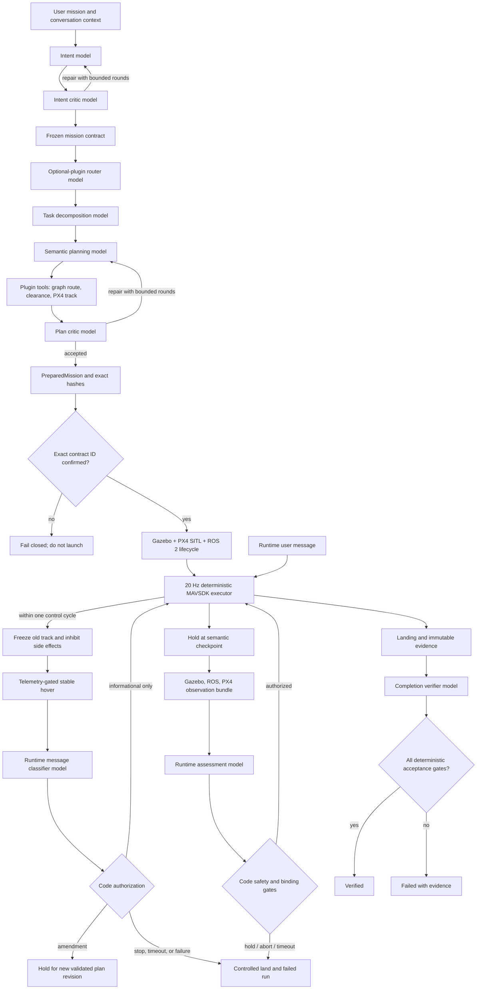
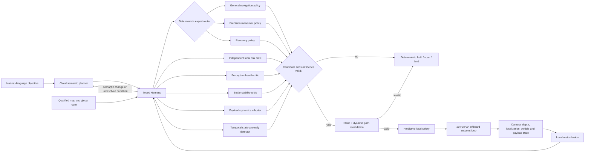

# Architecture and authority boundaries

The forward implementation plan, runtime/training architecture and whole-product
completion gates are maintained in [AUTONOMY_ARCHITECTURE_MASTER_PLAN.md](AUTONOMY_ARCHITECTURE_MASTER_PLAN.md).
This document retains detailed authority boundaries and historical context; it
does not independently qualify the current model package.

For the current continuous-control candidate, verified limitations and the next
implementation batch, read [CONTINUOUS_CONTROL_UPGRADE.md](CONTINUOUS_CONTROL_UPGRADE.md).
Historical flight results in this document apply to their original packages and
asset bindings. They do not establish qualification for the current direct-control
weights, whose latest closed-loop trial failed.

## Design objective

The core turns an open-ended natural-language mission into a bounded, reviewable,
executable mission for the real DroneDream simulation stack. A model contributes
reasoning at several narrow stages; it does not replace flight control, geometry,
runtime binding, or the safety supervisor.

## Authority layers

| Layer | May do | May not do |
|---|---|---|
| Model roles | Interpret intent, decompose tasks, critique plans, assess checkpoint observations, review completion evidence | Arm, command motors, change coordinate frames, waive deterministic gates |
| Local learned policies | Request bounded body velocity and yaw rate, request a new scan, hold, abort, and estimate risk within a fixed tensor contract | Invent world coordinates, bypass perception freshness, or train during flight |
| Harness | Route typed context between cloud roles, local policies, tools, safety, and evidence; select only content-bound admitted packages | Convert model output directly to actuator commands or treat simulation admission as production qualification |
| Plugin tools | Read qualified assets, compute routes, check clearance, create typed PX4 tracks, emit receipts | Obtain actuator authority or silently mutate source assets |
| Orchestrator | Run bounded model loops, freeze the mission contract, bind artifacts, require confirmation | Continue after exhausted rounds or invalid structured output |
| Checkpoint coordinator | Ask the runtime model for a typed decision while the aircraft holds | Authorize a mismatched checkpoint, moving aircraft, low battery, collision, or timeout |
| Runtime interruption coordinator | Classify a bound user message after stable-hold evidence exists | Advance the old plan, issue coordinates, or authorize a failed hold |
| PX4 executor | Stream validated NED velocity commands for learned motion and position/velocity commands for supported hold and safety phases at 20 Hz | Invent a route or reinterpret natural language |
| Safety and acceptance code | Stop execution, land, validate hashes/timing/goal/landing/process state | Be relaxed by model output |

## Model-call topology

The nominal mission uses six cloud planning calls: intent, intent critique, optional-plugin
routing, task graph, semantic plan, and plan critique. Either critique can create another
bounded proposal round. Deterministically extracted user constraints are bound by Core
before intent review, so exact safety and execution restrictions do not depend on a model
copying strings perfectly. During execution, compact local policies can participate at a bounded high-rate
cadence using calibrated metric perception, temporal vehicle state, and an egocentric
reference toward the cloud planner's coarse route. Cloud assessment is
reserved for semantic checkpoints, material uncertainty, user amendments, and global
replanning while deterministic code holds the vehicle. One final cloud call reviews the
collected evidence; code still makes the final verified/failed decision.

The verified campus-gate run therefore used ten calls: five planning calls, four live
checkpoint calls, and one completion call. The topology is data-driven: a different
mission can produce a different task graph and checkpoint count.

A message submitted during execution is a separate event within the same task thread.
Deterministic code claims it at the next 20 Hz poll, disables old-plan advancement and
semantic side effects, and stabilizes a current-position hold before the classifier call.
The measured runtime-interruption provider latency was 28.272 seconds; the vehicle held
through that entire interval. Emergency wording forces landing even if a model were to
misclassify it. Destination, payload, route, or speed changes force a new plan revision
  and can never resume the old track. A destination amendment is grounded against the
  selected map, routed from the telemetry-confirmed hold position through the new target to
  the original return node, continuously checked against the vehicle envelope, and adopted
  only through a hash-bound replacement-track handshake.

## Control separation

`RuntimeCheckpointDecision.action == "accept"` is necessary but insufficient to resume.
The coordinator also checks all of the following from observed data and frozen bindings:

- contract ID, segment ID, checkpoint ID, and expected route index match;
- observed ENU position is within the checkpoint tolerance;
- speed is below the stable-hold limit;
- battery, collision, route-deviation, runtime, and observation-age limits pass;
- model response arrives before the bounded deadline;
- the response does not request an unknown or out-of-scope operation.

If any check fails, the executor never advances to the next segment. It holds only for
the bounded decision interval, then follows the configured controlled-landing exit.

## Context and structured boundaries

Conversation history is retained as typed events. Before a provider call, older content
can be compacted into a bounded structured summary while the active mission contract,
current plan, required tool receipts, errors, and latest observations remain explicit.
Intent calls receive entity identity and aliases without route coordinates or source-file
paths. Semantic planning receives hash-bound topology, route metrics, environment limits,
and mission-relevant entities; qualified tools retain ownership of raw graph geometry.
Plan criticism receives the selected-plan receipts plus a stable summary of rejected
exploratory attempts, rather than an unbounded dump of every intermediate artifact. Provider
outputs are parsed directly into Pydantic models; a JSON-shaped string is not treated as
valid merely because it parses.

The verification matrix is compiled by Core from the frozen contract, task graph, semantic
plan, metric route, continuous-clearance report, PX4 track, runtime checkpoints, and action
adapters. A critic may identify a repair, but cannot create evidence. Before execution and
again when restoring a prepared mission, Core recompiles the matrix and requires exact
equality; runtime and completion obligations name their evidence authority and explicitly
reject model-only proof.

Generated JSON Schemas under `schemas/` are the integration boundary for future ROS,
service, and product-shell consumers. Change a contract deliberately, regenerate the
schemas, and review both the Python diff and Schema diff.

`conversation_id` identifies the user-visible task, and its random `mission_id` remains
stable across preflight edits. Each accepted replacement receives a new `plan_revision_id`;
each launch receives a new `execution_id`; each message receives a new `message_id`.
SQLite `BEGIN IMMEDIATE` transitions prevent an active execution from accepting a
preflight revision. Runtime inbox messages must match all four identities before they are
allowed to affect control state.

## Hybrid control history and current boundaries

The following diagram describes the historical candidate-selection loop. It is
not the active continuous-action wiring or an installation manifest. The current
target diagram and work ledger live in the master plan; the direct-action code
now uses an action-conditioned critic and the shared physical-axis mapping.

The cloud model is not polled for every control tick. Long provider latency is absorbed
only behind a telemetry-confirmed hold. The local learned loop targets millisecond-scale
inference and directly proposes four normalized body-frame control axes. The vehicle
contract maps these axes to a short-lived forward-right-up velocity and bounded yaw-rate
request; it never treats the policy output as a world coordinate. The request is bound
to the source expert, model call, sensor snapshot hash, acceleration/jerk envelope, and expiry;
deterministic safety can label and apply a direction override or brake on every sensor tick.

The desktop Runtime reads local experts only from its signed resource manifest and a
scoped local-policy catalog. When eligible resources are present, the desktop launch path
uses `local-policy` as the primary navigation provider with a one-second maximum replanning cadence
and a 250 ms hard call timeout. The user's selected cloud provider remains responsible for
planning, semantic checkpoints, mission amendments, and completion review; it is also a
hold-safe fallback if the local inference path fails. A catalog path may not escape the
Runtime resource root, and a simulation-admission receipt is rejected unless the catalog
is explicitly scoped to `simulation-only`; a production receipt is accepted only from a
`production-qualified` catalog. The signed desktop installer may carry a simulation-only
ensemble for Gazebo/PX4 work, but Runtime keeps that scope and cannot promote it to real
flight authority. The catalog, receipt, package manifest, every ONNX file, active vehicle,
sensor contract, and optional map must agree by content hash before inference can be used.
Between replans, every fresh depth frame re-derives the body-frame request from the latest
pose and rechecks calibrated geometry, relative dynamic-target motion, temporal flight
state, collision clearance, speed, acceleration, and jerk. A stale or incomplete encoder
set revokes motion instead of replaying an old coordinate target.

The expert router is deterministic and auditable. It requests precision control for
takeoff, landing, checkpoint, hover, local-slow, and waypoint-settle phases; it requests
recovery only for an explicit progress-stall or dynamic-obstacle trigger. Executor phase
names such as `TRACKING_RECOVERY` describe controller lifecycle and are not proof of one
semantic recovery incident. An ordinary `LOCAL_REPLAN` remains with the general or precision policy according to its
control profile; it is not failure evidence by itself. All other local navigation uses the
general policy. A role becomes selectable only when its
content-bound ONNX artifact is present. Missing specialists fall back visibly to the
general policy. The inference result must report exactly the advisory experts the Harness
requested, so a model file cannot be listed in a package yet silently skipped at runtime.
Each local call also writes a typed inference trace containing the requested and selected
navigation roles, explicit fallback state, navigation-only action and risk, per-advisor
risk scores, aggregate risk, and controller scale. This separates what the navigation
expert proposed from what the conservative ensemble finally authorized.
The historical candidate-selection visual package contained ten ONNX experts: general navigation,
precision maneuver, recovery, perception encoding, risk, perception health, settle
stability, state anomaly, payload dynamics, and cross-modal consistency. Its model files
total 14,014,000 bytes. The package has been rebound without altering any model bytes to
the current native, physically verified vehicle contract and has passed a fresh held-out
offline admission; combined visual preprocessing, encoding, navigation, and applicable
advisor P99 was 30.268 ms under the 250 ms deadline. Earlier closed-loop campaigns prove
the same byte-identical experts can participate in PX4/Gazebo, but the new vehicle binding
still requires its own current-asset closed-loop run before that integration claim is
carried forward. The package remains simulation-only until repeated, multi-map production
campaigns and real-hardware qualification pass.

Dense controller schedule indices do not reset mission progress indefinitely. A semantic
progress window follows one real navigation goal across those indices. Its independent
recovery and controlled-landing deadlines default to 20 and 60 seconds and are recorded in
the qualification plan; a development campaign may tighten them without changing ordinary
tracking-recovery limits. Ordinary progress clears both deadlines. The decision trigger is
preserved through every local hold/replan target refresh so the next scheduled local-model
cycle can invoke the recovery role without waiting for a cloud call. Each recovery request
also receives a hash-shaped episode identity that remains stable until measured progress
resumes. A continuous dynamic-obstacle encounter receives one goal-bound episode identity
across its moving position signatures and closes after a bounded quiet interval. Recovery
datasets require the identity, prove that a later snapshot materially
reduced range or advanced the semantic goal, and retain at most one training row from each
episode. This prevents several correlated votes from one stall, an ineffective recovery,
or a normal local replan from being counted as independent successful recovery cases.

Temporal state-anomaly detection has a fixed eight-observation tensor contract. The
historical visual simulation package included that artifact; its anomaly score joins the
navigation and risk scores through a conservative maximum and can only remove motion
authority. A separate cross-modal critic compares the bounded multimodal sensor summary
and can likewise only increase aggregate risk. Both new artifacts were admitted on a
complete PX4/Gazebo depth-loss mission that was disjoint from their training and
configuration-selection missions. The
perception-health critic independently reads the bounded sensor/sector state and can veto
motion even if the navigation policy remains confident. A deterministic freshness and
identity contract remains the primary hard veto: an already-unhealthy stream is recorded
as a hash-bound snapshot but is not sent through learned inference. A development-only
3.4-second depth-frame-loss campaign exercised 15 such sensor-rate unhealthy cycles,
recovered the stream, and completed landing without route fallback. Its explicit
`development_fault_injection_absent` gate is false, so qualification aggregation must
reject it even though the operational behavior was safe. The settle-stability critic runs
for every precision control profile, including a recovery vote during a tight maneuver,
and uses the recent state window to veto unstable takeoff,
hover, checkpoint, pickup, and landing transitions. The payload-dynamics adapter reads
the hash-bound payload state plus the same temporal history; it may raise risk or reduce
the candidate controller lookahead to 10--100% of the already revalidated bound. In
continuous control, the same scale actually reduces the four requested physical
velocity/yaw-rate axes; the independent action critic evaluates that scaled
proposal, without consuming legacy candidate tensors. It cannot
increase speed, clearance authority, path length, or lease duration. The runtime records
every executed advisor in the model identity and rejects a call if the Harness requested
an advisor but the backend did not actually execute it. A hover phase alone does not
pretend that a payload is attached: the payload advisor becomes applicable only after a
runtime attachment/custody/stability receipt supplies real state. None of these additional
advisor artifacts is currently admitted for production flight.

Model completion consumption also requires fresh metric perception. Later sensor
data may veto a pending result, but cannot renew the command's original
submission-bound deadline or manufacture a new lease for an expired model result.
Late/stale rejections remain recorded separately from successful-call latency;
successful-call percentiles alone are not evidence of a healthy realtime loop.

Visual streams are identity-bound rather than inferred from file presence. The optional
local perception encoder receives only the qualified vehicle's onboard forward-RGB topic;
the static overview camera used by the desktop live monitor is a separate operator view
and is never a model input. Runtime startup requires the selected package's visual-encoder
contract and the onboard RGB configuration to agree exactly. Metric depth remains the
collision-authoritative sensor; RGB supplies supplementary semantics and cannot reduce a
clearance requirement.

Local packages have two scopes. A general package is bound to exact vehicle and sensor
contracts and is trained across multiple map campaigns. A map specialist also binds one
semantic-map hash and one qualified general-package hash. A specialist may be selected
only for that exact map and only while its general rollback remains eligible. Hash drift,
missing artifacts, an incompatible tensor signature, insufficient confidence, or excess
latency makes the package ineligible.

Qualification is deliberately separated into stages:

1. Build datasets from complete source campaigns, never random rows from the same flight
   on both sides of the split. Snapshot and cycle files must match the hashes in mission
   evidence. Navigation specialists must use the selected navigation expert's pre-advisor
   trace; a final ensemble hold cannot be mislabeled as the navigation expert's own vote.
   Fallback calls are not ordinary specialist examples. An explicit, verified-source
   bootstrap mode may train a simulation-only specialist classifier, but it records the
   teacher role, requires typed pre-advisor traces, and can never grant qualification.
   Continuous four-axis targets may come only from typed direct-control output or
   hash-bound commands that a verified deterministic teacher actually executed; a legacy
   candidate endpoint is never converted into a control label. Payload samples require
   recorded state, mass, and declared-limit evidence.
2. Train navigation, risk, perception-health, settle-stability, payload-dynamics, and temporal models
   independently outside an active flight. Each selected advisor needs at least 20 safe
   and 20 risky held-out samples, so missing negative coverage fails closed.
3. Benchmark the actual combined ONNX Runtime path on a completely held-out campaign.
   When an immutable base package is composed with new experts, previously admitted
   advisor evidence may be inherited only for byte-identical artifacts proved by the
   composition receipt; every added or replaced artifact requires fresh mission-level
   admission data that is disjoint from both training and configuration selection.
4. Issue a content-bound simulation-only admission if all offline quality and latency
   gates pass.
5. Run at least 20 distinct full Gazebo/PX4 missions, require zero collisions, at least
   95% verified success, full local-model authority evidence, and multiple semantic maps
   for a general policy. Reconstruct the expected Harness stack from every hash-bound
   snapshot and require every advertised package role to be invoked whenever applicable
   and exercised at least once across the campaign. Any local invocation failure or hard
   timeout fails the trial even when the deterministic controller held safely and the
   vehicle later recovered; successful-call percentiles may not hide rejected tail calls.
6. Issue a separate qualification receipt. Only that receipt can make the package
   eligible for non-development selection; admission alone never can.

## Failure and safety exits

- Provider authentication, timeout, malformed output, or exhausted repair rounds:
  planning fails and execution is not launched.
- Asset/hash mismatch or missing explicit contract confirmation: execution is not launched.
- PX4/Gazebo/ROS process startup failure or premature exit: the run fails.
- Checkpoint timeout, model hold/abort, coordinate mismatch, motion, collision, low battery,
  route deviation, or stale observation: stop advancing and land.
- Runtime-message identity mismatch, unstable hold, classifier failure, decision timeout,
  or missing replacement track after a bounded amendment hold: controlled landing.
- Goal, landing, ULog, timing, process-cleanup, or evidence-chain failure: never label the
  run verified, even if the vehicle appeared to reach the destination.

## Publication boundary

First-party Core source is MIT-licensed. The DroneDream product repository remains
the desktop and Runtime source. Source publication does not authorize release of
user records, credentials, private experiment history, or imported third-party assets.
Keep the existing incubation history private and export only reviewed source content.
Publishing source does not waive current model admission or end-to-end flight gates.
See [the publication policy](open-source-publication.md).
